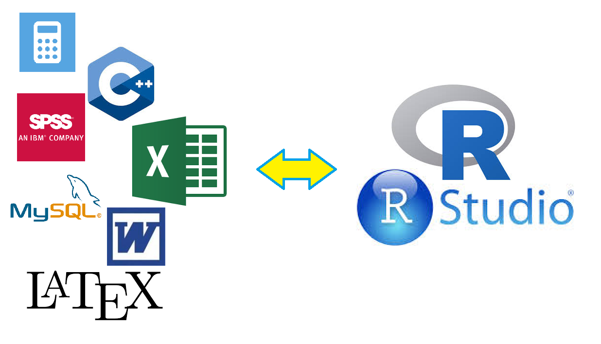
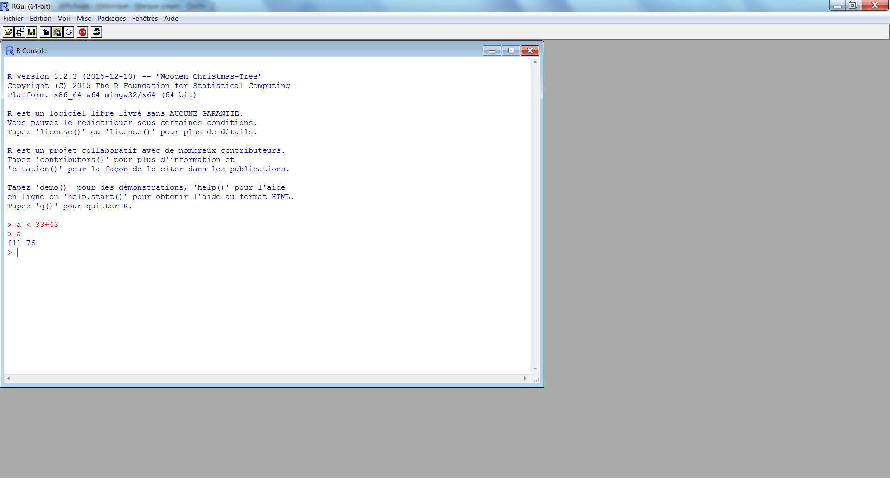
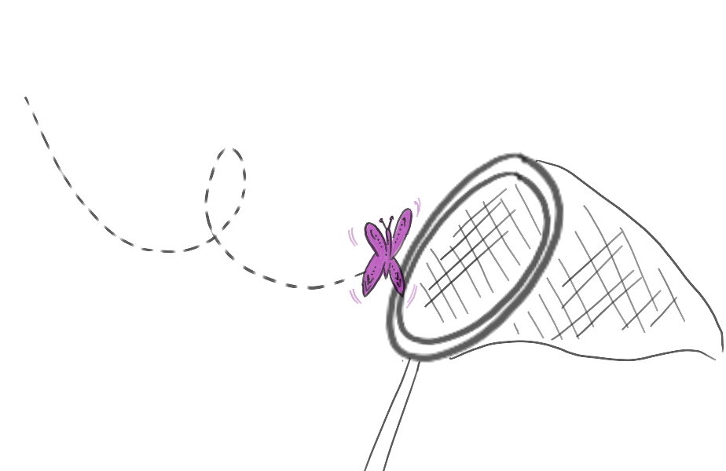
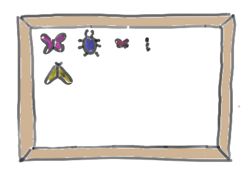
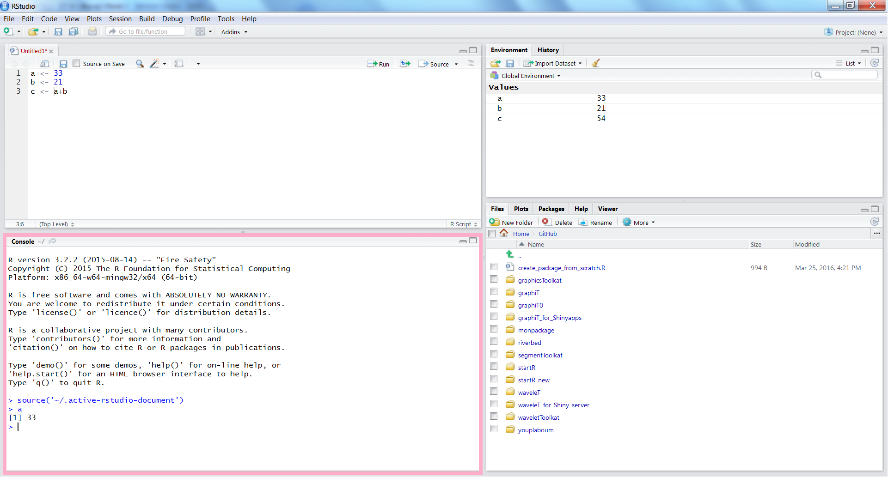
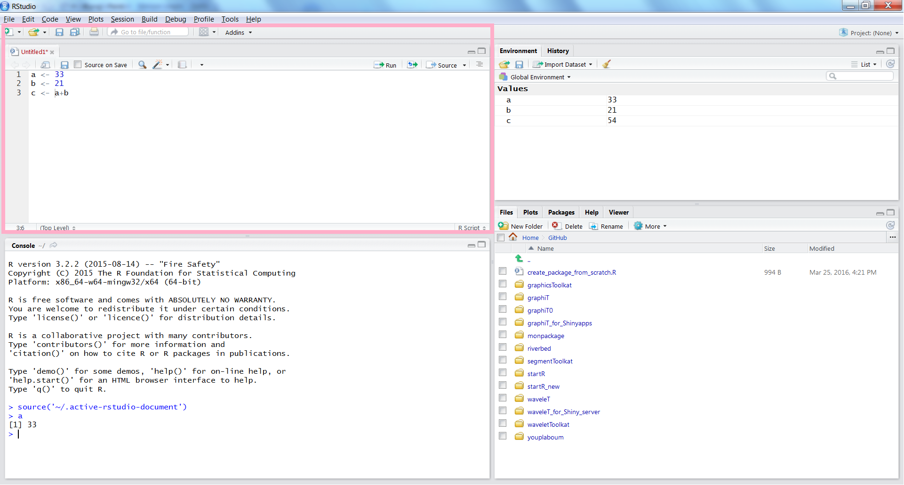
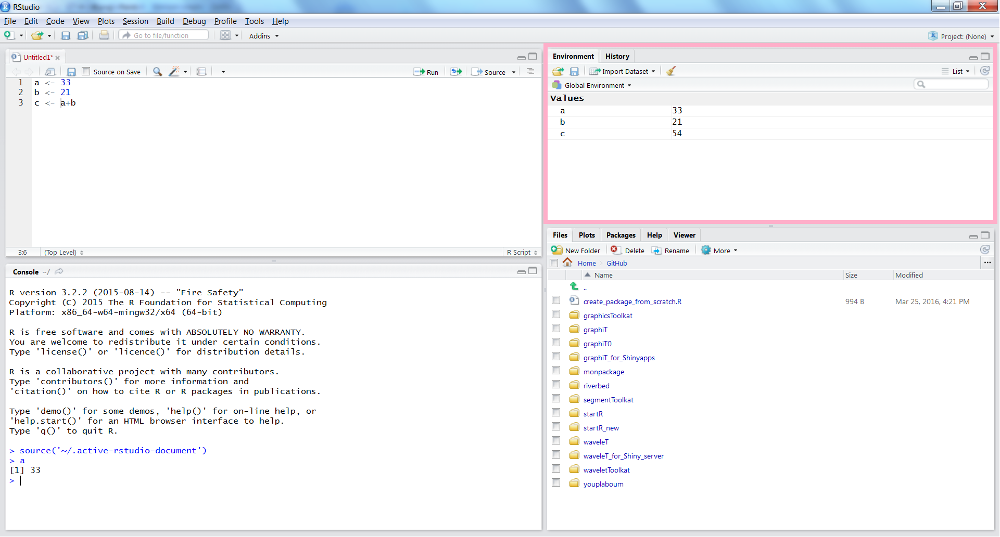
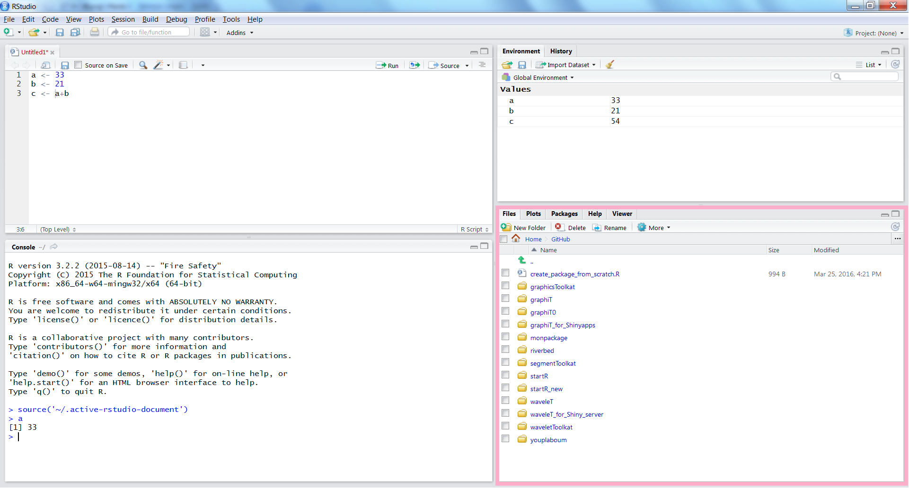

```{r setup, echo=FALSE, message=FALSE, warning=FALSE}
options(width=50)
knitr::opts_chunk$set(comment = NA)
```


# Pourquoi utiliser le logiciel R?

<table><tr><td>
Le langage R est un **langage de programmation** et un **environnement mathématique** utilisé pour le **traitement de données** et l'**analyse statistique**.

Il est en outre d'utilisation **libre** et **gratuite** et peut être téléchargé par exemple à l'adresse suivante: http://cran.r-project.org/

L'installation prend au plus quelques minutes.

</td><td>
Il permet de réaliser

- des **calculs arithmétiques** 
- des **tris et croisements** de données 
- une très large variété de **graphiques** 
- des **programmes** (automatisation de traitements)
- de la **modélisation et simulations numériques**
- une très large variété de **traitements statistiques** (c'est ce pour quoi il est le plus reconnu)
- des **rapports**, **pages web** et **diaporamas**
</td></tr></table>

# Pourquoi utiliser le logiciel R?

<table><tr><td>
Il peut donc remplir les fonctions 

- d'une **calculatrice**, 
- d'un **tableur**, 
- d'un **langage de programmation**, 
- d'un **logiciel de statistiques**,
- d'un **logiciel de dessin** 
- d'un **éditeur de rapports et de présentations**...


</td><td>

</td></tr></table>

En contrepartie de sa polyvalence et de sa flexibilité, R peut être un peu déroutant au premier abord, car il ne s'agit pas d'un logiciel "clic-boutons": on exécute les différentes opérations à travers l'exécution de **lignes de commande**.

# Apprendre R

{width=1000px}

# Console, commandes

<table><tr><td> Au lancement de R, une fenêtre (la **console**) apparaît: le symbole ">" indique que R est prêt à exécuter toute ligne de commande que nous allons lui fournir.


 </td><td>
Un exemple de **ligne de commande**:

```{r}
2+2
```

Taper entrée pour exécuter la commande. R exécute la commande et nous affiche le résultat.
</td></tr></table>

# Commentaires, historique des commandes, commande incomplète

<table><tr><td>

**Commentaires**

```{r}
32.7*59.6 # multiplication
```

Les indications précédées du symbole `#` sont des **commentaires**. Ils sont ignorés par R mais vous seront très utiles pour **annoter vos scripts**.

**Historique**

Si l'on exécute plusieurs lignes de commandes dans la console, on peut "récupérer" les **lignes de commandes précédemment exécutées** avec la flèche **$\uparrow$** ou au contraire en récupérer de plus récentes avec **$\downarrow$**.

</td><td>

**Commande incomplète**:

```{r, eval=FALSE}
>4+3/
+ 
```

Avoir le signe `+` au lieu de l'invite de commande classique `>` montre que R attend **la suite de la commande** car elle est manifestement incomplète à l'issue de la première ligne...

```{r, eval=FALSE}
>4+3/
+  2
```
```{r, echo=FALSE}
5.5
```

</td></tr></table>

# Assignation

<table><tr><td>
Lorsque vous exécutez une commande, vous pouvez en observer le résultat directement dans la console:

```{r}
32.7*59.6 
```

Vous pouvez également choisir d'attribuer ce résultat à un **objet**.

```{r}
a <- 32.7*59.6 
```

On dit qu'on **assigne un nom à un objet**. On a ainsi créé les objets a et b.


{width=350px}


</td><td>

"=" est également un opérateur d'assignation:

```{r}
a = 32.7*59.6 
```


En revanche, R est **sensible à la casse** donc les deux commandes suivantes créeront deux objets distincts!

```{r}
pouetpouet <- 32.7*59.6 
Pouetpouet <- 32.7*59.6 
```

Attention, un objet est "écrasé" quand on assigne son nom à un autre objet:

```{r}
tuttut <- 33
tuttut <- 45
tuttut
```


</td></tr></table>

# Environnement

<table><tr><td>

```{r}
a <- 32.7*59.6 
b <- 53/59 
```

Lorsque vous exécutez les commandes ci-dessus, **rien ne s'affiche dans la console**. Cela ne signifie pas pour autant que rien ne s'est passé... Vous avez **créé les objets a et b**, qui font désormais partie de votre environnement de travail... 

</td><td>

Rappelez-vous, ces objets apparaissent dans la zone **Environnement** de RStudio. Vous pouvez également afficher la liste des objets dans l'environnement global de la manière suivante:

```{r}
ls()
```


{width=450px}

</td></tr></table>

# Affichage des objets

<table><tr><td>
Pour afficher la valeur des objets dans la console, plusieurs possibilités:

```{r}
a
print(a)
```
</td><td>
Vous pourrez par la suite manipuler les objets de différentes façon... Par exemple, ici on peut les utiliser pour de simples opérations arithmétiques:


```{r}
a+b  # calcul puis affichage
c <- a+b # calcul et creation d'objet
print(c) # affichage
```
</td></tr></table>


# RStudio: scripts et IDE

<table><tr><td>

**Historique vs Script**

Comment **garder une trace pérenne** des différentes commandes et de leur succession?

L'ensemble des lignes de commande exécutées dans la console (y compris tâtonnements) = l' **historique** (.Rhistory)

L'ensemble des lignes de commandes nécessaires à exécuter une tâche = un **script** (.R)

(i.e. un fichier texte contenant l'ensemble des lignes de commande mises au propre et commentées!)

</td><td>

**l'IDE RStudio**

Nous allons travailler sur un éditeur de script (ou plus précisément un **IDE**, pour Integrated Development Environment) le logiciel **RStudio**. 

Il est lui aussi **libre et gratuit** et peut être téléchargé à l'adresse suivante:
http://www.rstudio.com/ide/. 

</td></tr></table>

# RStudio: Fonctionnalités

<table><tr><td>
Dans RStudio, quatre zones apparaissent:

- **Source** en haut à gauche,
- **Console** en bas à gauche, 
- **Environnement** en haut à droite
- **Plots** en bas à droite

</td><td>


</td></tr></table>

# RStudio: zone Console

<table><tr><td>
La zone Console de RStudio correspond en fait à l'**interpréteur R de base**... C'est cette console qui s'ouvre quand vous lancez R (sans RStudio)... Simplement ici, la console est "enrobée" de différents outils pour vous aider à travailler...

</td> <td>


</td></tr></table>

# RStudio: zone Source

<table><tr><td>
La zone **Source** constitue l'éditeur de code à proprement parler. C'est dans cette zone que vous allez écrire vos scripts. 

Les calculs sont exécutés dans la zone **Console**. On peut envoyer les codes de la zone "Source" vers la zone "Console"

- grâce au bouton **Run** (qui exécute la ou les lignes de commande sélectionnée(s)) 
- grâce au bouton **Source** (qui exécute l'ensemble des lignes de commande du script). 

</td> <td>

</td></tr></table>

# RStudio: zone Environment/History

<table><tr><td>
- onglet **Environment**: il vous permet de consulter l'ensemble des objets de votre environnement
- onglet **History**: il vous permet de consulter l'historique de vos commandes (i.e. l'ensemble des commandes que vous avez exécutées depuis le lancement de votre session).
</td> <td>

</td></tr></table>

# RStudio: zone Files/Plots/Packages/Help

<table><tr><td>
- onglet **Files**: il vous permet de naviguer dans vos dossiers et d'ouvrirs/renommer/supprimer vos fichiers.
- onglet **Plots**: c'est là que s'afficheront (par défaut) les graphiques produits. Il vous permet donc de vérifier d'un coup d'oeil vos sorties graphiques... 
- onglet **Packages**: vous montre l'ensemble des packages installés et chargés pour la session actuelle.
- onglet **Help**: vous pouvez y consulter les fichiers d'aide associés aux différentes fonctions de R.

</td> <td>

</td></tr></table> 

# Haut les coeurs!

{width=800px}
    
# On récapitule!

<table><tr><td style="width: 30%;">


</td><td style="width: 70%;">
- **usages** de R
- **console**, commandes, **script**, commentaires, historique
- assignation, **objets**, **environnement**, affichage
- **RStudio**: organisation de l'IDE

</td></tr></table>
