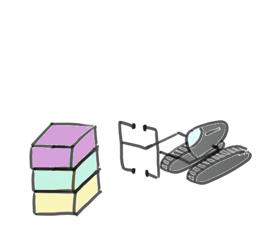

```{r setup, echo=FALSE, message=FALSE, warning=FALSE}
library(dplyr)
options(width=50)
knitr::opts_chunk$set(comment = NA)
```

# Création d'objets

<div>
Nous avons vu dans la section précédente **comment créer des objets très simples** et comment les **assigner à un environnement**.

Il y a en fait une multitude de types d'objets possibles dans R. Ici nous allons aborder

- les **vecteurs**
- les **facteurs**
- les **listes**
- les **tableaux de données**
</div>

# Création de vecteurs

<table><tr><td style="width:30%">
On appelle **vecteur** toute **séquence d'éléments** de même type, par exemple: 

v1= 

        2.3 3.6 1.1 2.4 2.5 10.2 5.1 2.0 
 
v2=
    
        "Paris" "Lyon" "Marseille" "Rennes" "Montpellier"

ou v3=

        TRUE FALSE FALSE TRUE TRUE

</td><td style="width:20%">

</td><td style="width:50%">
En R, ces vecteurs s'écrivent: 

```{r}
v1 <- c(2.3,3.6,1.1,2.4,2.5,10.2)
v1
v2 <- c("Paris","Lyon","Marseille")
v2
v3 <- c(TRUE,FALSE,FALSE,TRUE,TRUE)
v3
```
Les éléments d'un vecteur peuvent être **nommés** de la façon suivante:

```{r}
vn <- c(metro=1,boulot=8,dodo=9,autre=6)
vn
```


</td></tr></table>
     
# Création de vecteurs: séquences, répétitions

<table><tr><td style="width:35%">
On peut également créer des vecteurs correspondant à: 

- des **séquences de valeurs régulièrement espacées**


```{r}
# valeurs de 0 à 10 par pas de 2
v4 <- seq(from=0,to=10,by=2)
v4
# 5 valeurs regulierement espacees de 2 a 13
v5 <- seq(from=2,to=13,length.out=5)  
v5
# nombres entiers de 0 a 7
v6 <- 0:7
v6
```
</td>
<td style="width:15%">

</td>
<td style="width:35%">
ou bien:

- des **séquences de valeurs répétées**

```{r}
# repetition de "date1" 5 fois
v7<-rep("date1",5)
v7
# repetition du vecteur v6 3 fois
v8<-rep(v6,3)
v8
```
</td>
<td style="width:15%">

</td>
</tr></table>

# Classes des objets

<table><tr><td>

Les vecteurs peuvent être de classes différentes selon le type de valeurs qu'ils contiennent (par contre toutes les valeurs d'un vecteur sont supposées être d'un même type).

Ils peuvent par exemple être de mode

- **numérique** 
- **caractère** 
- **logique**, c'est à dire que les valeurs qu'ils contiennent sont de type vrai / faux (TRUE / FALSE ou T / F).

</td><td>

Par exemple, pour v1, v2, et v3:

```{r}
v1 <- c(2.3,3.6,1.1,2.4,2.5,10.2,5.1,2.0)
class(v1)
v2 <- c("Paris","Lyon","Marseille")
class(v2)
v3 <- c(TRUE,FALSE,FALSE,TRUE,TRUE)
class(v3)
```
</td></tr></table>

# Création de vecteurs

<table><tr><td style="width:40%">
Remarquez que l'on peut aussi utiliser `c()` pour combiner plusieurs vecteurs:

```{r}
v4
v5
vglobal<-c(v4,v5)
vglobal
```

</td>
<td style="width:20%">

</td>
<td style="width:40%">
Si l'on tente quelque chose comme 

```{r}
v6
v7
vessai=c(v6,v7)
vessai
```

R ne renvoie pas de message d'erreur, mais fait en sorte que toutes les valeurs de vessai soient d'un même type (des chaînes de caractère ici: voyez les guillemets autour des valeurs de v7).
</td></tr></table>

# Valeurs manquantes

<div>
Il peut arriver que certaines valeurs d'un objet soient **non renseignées**. En R, ces valeurs s'écrivent `NA` (pour **n**ot **a**vailable).

Par exemple:

```{r}
v9 <- c(3.2, NA, 8.9, 42.3, 59.2, NA)
```

{width=40%}
</div>

#  Création de facteurs

<table><tr>
<td style="width:70%">
Les facteurs ressemblent généralement à des vecteurs de mode caractère, à la nuance près qu'ils comprennent généralement plusieurs **niveaux**, comme par exemple

```{r}
f1=factor(c(rep("date1",3),rep("date2",3)))
f1
levels(f1)
```

La nuance entre vecteurs et facteurs est importante pour un certain nombre de fonctions implémentées dans R, il est donc assez souvent nécessaire de convertir les vecteurs en facteurs et inversement.
</td>
<td style="width:30%">

</td></tr></table>
</td>

# Création de listes 

<table><td style="width:60%">
Une liste est un **assemblage d'objets** qui peuvent être de **natures et/ou de tailles différentes**. Par exemple, la liste l1

```{r}
l1=list(sites=c("Paris","Lyon"),
        nb=c(1100,332,52,532,33,66,22,114))
l1
```
rassemble un vecteur de taille 2 et un vecteur de taille 8 au sein d'un même objet.

En pratique, **de nombreuses fonctions de R renvoient un objet de type liste** (par exemple, un objet "régression linéaire", renvoyé par la fonction lm, comprend entre autres choses un vecteur de coefficients de la régression et un vecteur de résidus de la régression (donc deux vecteurs de tailles différentes).
</td>
<td style="width:40%">

</td>
</table>

# Création d'objets: tableaux de données

<table><tr><td>
Comme une matrice, un tableau de données compte **plusieurs lignes et colonnes**. En revanche, les colonnes (ou **variables**) d'un tableau de données **peuvent être de types différents**, et sont **nommées**.


{width=60%}

</td><td>

Voici comment créer un tableau de données (**tibble**) sous R, en assemblant plusieurs vecteurs de même taille:

```{r}
t1 <- tibble(Espece = c("Chien","Dauphin",
                        "Chat","Eponge"),
             Nom = c("Lassie","Flipper",
                     "Garfield","Bob"),
             Date = c(1940,1964,1978,1999))
t1
```


Remarque: les objets de type `data.frame` sont comparables aux `tibbles`, avec quelques différences notamment liées au typage des variables et à l'affichage.

</td></tr></table>

# Création d'objets, conversion d'objets

<table><tr><td>
Pour interroger R quant au type (vecteur, facteur, tableau, matrice, etc.) ou au mode (numérique, caractère, logique, etc.) d'un objet, on utilise les fonctions de type **is.____**. 

Par exemple:

```{r}
v6
is.factor(v6)
is.numeric(v6)
```


</td><td>
On peut convertir un objet d'un type ou mode à un autre en utilisant les fonctions de type **as.____**. Par exemple,

```{r}
v6f <- as.factor(v6)
v6f
```         

convertit le vecteur v6 en facteur pour créer v6f.

{width=60%}
</td></tr></table>

# Indexation

<table><tr>
On peut s'intéresser à une partie d'un objet, par exemple un ou plusieurs éléments d'un vecteur ou d'un facteur.
</tr>
<tr>
<td style="width:33%">

</td><td style="width:33%">

</td><td style="width:33%">

</td></tr>
</table>

# Indexation d'un vecteur ou d'un facteur

<table><td>
On a accès au i$^{eme}$ élément d'un vecteur/facteur par la commande:

```{r, eval=FALSE}
v[i]
```

Par exemple:
```{r}
v1
v1[4]
v1[1:3]  # les trois premieres valeurs
v1[c(2,5,6)]
v1[rep(1:3,5)]
```

</td><td>
Pour un facteur:
```{r}
f1
f1[1:2]
```
Remarquez que dans les éléments n° 1 et 2 du facteur `f1`, il n'y a que la valeur "date1". Cependant, "date2" fait toujours partie des niveaux possibles de ce facteur!
</td></table>

# Indexation d'une liste

<table><tr><td>
Pour le i$^{eme}$ élément d'une liste on utilise des double crochets, ou bien le nom de l'élément auquel on s'intéresse:

```{r, eval=FALSE}
liste[[i]]
liste[["element"]]
liste$element
```

Par exemple, considérons notre liste `l1`:

```{r}
l1
```

</td><td>

```{r}
l1[[1]] #equivalent a l1$sites
l1$nb   #equivalent a l1[[2]]
```

Remarquez que l'élément `sites` de notre liste `l1` est un vecteur... Il est donc indexable comme un vecteur! De même pour `nb`.

```{r}
l1$sites[2]
l1$nb[5]
```

Par ailleurs, l'indexation d'une liste avec de **simples crochets []**  est également possible... Dans ce cas, on obtient une sous-liste!

```{r}
l1[1]
```

</td></tr></table>

# Indexation d'une tibble

<table><tr><td>
Pour la j$^{eme}$ variable d'un tableau on utilise des double crochets, ou bien le nom de la variable à laquelle on s'intéresse:

```{r, eval=FALSE}
tableau[[j]]
tableau[["variable"]]
tableau$variable
```

Par exemple, considérons notre tableau `t1`:

```{r}
t1
```

</td><td>


```{r}
t1[[3]]       # colonne 3 de t1
t1[["Date"]]  # colonne "Date" de t1
t1$Date       # colonne "Date" de t1
t1[3]         # tibble = colonne 3 de t1
```


</td></tr></table>

# Indexation d'une tibble

<table><tr><td>

Si l'on s'intéresse à l'élément d'une tibble qui se situe sur la i$^{eme}$ ligne et sur la j$^{eme}$ colonne, on y a accès par:

```{r, eval=FALSE}
t1[i,j]
```

```{r}
t1
```

</td><td>

```{r} 
t1[1,3] # ligne 1, colonne 3
t1[4,]  # ligne 4, toutes colonnes
t1[2,1:2] # ligne 2, colonnes 1 et 2
t1[2,c("Espece","Date")] # ligne 2, colonnes "Espece" et "Date"
```

</td></tr></table>

# On récapitule!

<table><tr><td style="width: 30%">

</td><td style="width: 70%">

- **types** d'objets: vecteurs, facteurs, listes, tableaux de données (tibbles)
- **création** des objets (combinaison, répétitions, séquences, valeurs manquantes, etc.)
- **classes** des objets (numérique, logique, caractère, etc.)
- **indexation**:
    + accès par la position ([i], [i,j], [[i]]) 
    + accès par le nom ($element, ["element"], [["element"]])

</td></tr></table>
