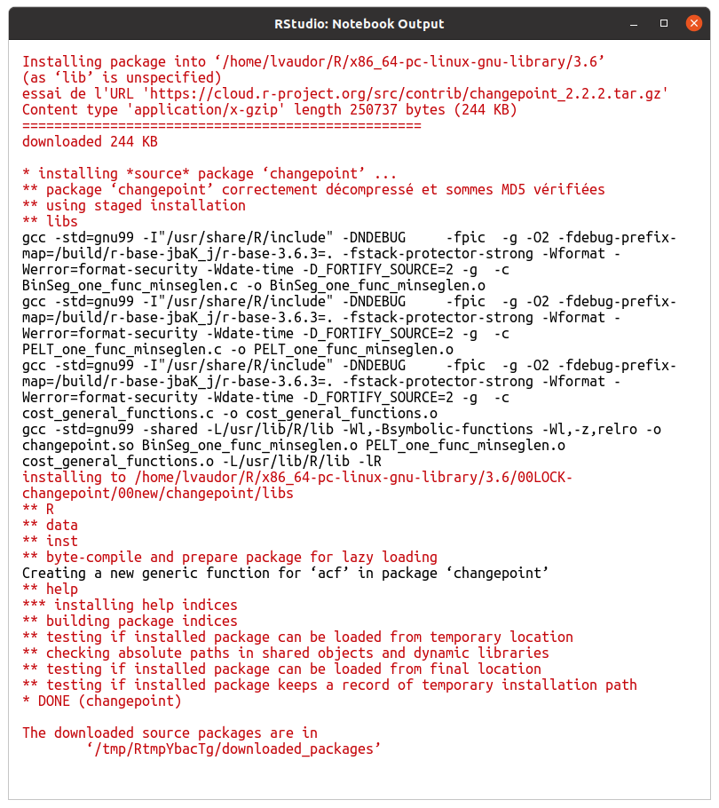
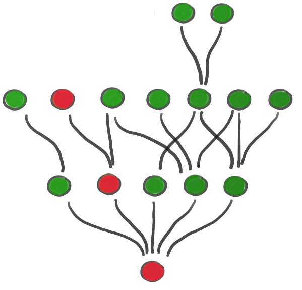

```{r setup, echo=FALSE, message=FALSE, warning=FALSE}
options(width=50)
knitr::opts_chunk$set(comment = NA)
```

```{r, echo=FALSE}
v1 <- c(2.3,3.6,1.1,2.4,2.5,10.2)
v2 <- c("Paris","Lyon","Marseille")
```

# Opérateurs arithmétiques

<div>
Ils permettent d'effectuer des opérations arithmétiques simples, comme des additions, des multiplications,etc.


```{r}
v1
```

```{r}
v1+4 # addition
v1-3 # soustraction
v1*5 # multiplication
v1/4 # division
v1^2 # puissance
```
</div>

# Opérateurs de comparaison

<table><tr><td>
Ils permettent de **comparer** des vecteurs entre eux.

```{r}
v1
```

```{r}
v1==3.6 # égal à
v1!=2   # différent de
```

</td><td>

```{r}
v1
```

```{r}
v1<4  # plus petit
v1>10 # plus grand
v1<=5 # plus petit ou égal
v1>=3 # plus grand ou égal
```
</td></tr></table>

# Opérateurs logiques

<div>
Ils permettent de **vérifier si une proposition est vraie** ou non.

```{r}
v1
```

```{r}
!(v1>10)    # NON logique
v1<2 & v1>5 # ET logique
v1<3 | v1>5 # OU logique
```

Notez également l'existence de la fonction **is.na()** qui permet d'évaluer si les éléments d'un vecteur sont vides ou non!

```{r}
v9 <- c(3.2, NA, 8.9, 42.3, 59.2, NA)
is.na(v9)
```
</div>

# Opérateurs: opérations terme-à-terme

<table><tr><td>
Pour réaliser les opérations R recycle les vecteurs autant de fois que nécessaire. 

Si v1 est de longueur *n* et v2 de longueur 1, v2 est recyclé *n* fois.

Si v1 et v2 sont de même longueur *n*, l'opération se fait terme à terme.

</td>
<td>
```{r}
v1=c(3,1,5,2,4)
v2=c(2,1,3,1,0)
v1+v2
```
</td></tr></table>

# Fonctions: exemples statistiques

<table><tr><td>

```{r}
x=c(2.3,5.5,3.7,10.5,11.5,4,3.6,6.1,2.4,12.9)
```

On peut décrire le **mode** d'une variable via sa **moyenne** ou sa **médiane**.

```{r}
mean(x)
median(x)
```

La **distinction entre moyenne et médiane** peut être importante quand la variable a une distribution **asymétrique**.


</td><td>
On peut décrire la **variabilité** des données à travers la **variance** ou l'**écart-type**:

Dans R, on calcule variance et écart-type à l'aide des fonctions `var()` et `sd()` 

```{r}
var(x)
sd(x)
```

</td></tr></table>

# Fonctions: exemples statistiques

<table><tr><td>
Le **quantile d'ordre p** de $x=(x_1,x_2,...,x_n)$ correspond à la valeur $\lambda$ telle que p\% des données sont inférieures à p.

\begin{eqnarray}
pr(X \leq \lambda)=p
\end{eqnarray}

Les quantiles d'ordre 25\%, 50\%, et 75\% sont aussi appelés **premier quartile**, **deuxième quartile** (ou **médiane**), et **troisième** quartile.

```{r}
quantile(x, 0.10)
```

Le quantile d'ordre 10\% (ou 0.10) de x est `r quantile(x, 0.10)`. 

Cela signifie que seulement 10\% des valeurs de x sont inférieures à `r quantile(x, 0.10)`. 


</td><td>

Par ailleurs, le **minimum** et **maximum** des variables peuvent être affichés comme suit:

```{r}
min(x)
max(x)
```

</td></tr></table>

# Fonctions : Arguments

<table><tr><td>
Nous avons d'ores et déjà utilisé un certain nombre de fonctions, comme 

- **c()**, 
- **seq()**, 
- **rep()**, 
- **mean()**, etc.

Toutes les fonctions que nous avons utilisées jusqu'à présent sont définies sur le **package de base** de R. 

Les fonctions sont des **objets** qui ont toutes un **point commun**: elles s'écrivent avec des **parenthèses**, dans lesquelles l'utilisateur précise la **valeur des arguments** si besoin est.

</td><td>
Les arguments peuvent être **obligatoires** (la fonction ne peut pas fonctionner si ces arguments ne sont pas fournis par l'utilisateur) ou au contraire **optionnels**. Par exemple, dans 


```{r}
quantile(x=x, probs=0.1)
```

l'argument `x` est obligatoire, et l'argument `probs` est optionnel. On peut ainsi ne passer que l'argument `x` à la fonction:

```{r}
quantile(x=x)
```
               
</td></tr></table>

# Fonctions: Ordre et noms des arguments

<table><tr><td>
Si l'on passe les arguments à la fonction **dans le bon ordre**, on n'a pas besoin de préciser le nom des arguments. Ainsi, il est possible d'appeler la fonction `quantile` des deux manières suivantes:

```{r}
quantile(x=x, probs=0.1)
quantile(x,0.1)
```

En revanche, l'appel suivant produira une erreur:

```{r, error=TRUE}
quantile(0.1,x)
```

</td><td>
Pour accéder aux **informations** quant aux **arguments** d'une fonction, on peut consulter l'aide associée des deux façons suivantes:

```{r, eval=FALSE}
help(quantile)
?quantile
```


</td></tr></table>

# Fonctions: Aide

<table><tr><td>
Le fichier d'aide associé à une fonction est toujours structuré de la même manière. Sans trop détailler, voici les parties qui me semblent les plus importantes...

- **Description** qui décrit succintement le but de la fonction
- **Arguments** qui détaille les arguments, vous montre l'ordre dans lequel ils sont attendus, et vous précise leur effet ainsi que leurs valeurs par défaut (le cas échéant).
- une partie **Exemples** qui permet généralement de tester la fonction pour comprendre rapidement son usage.

**Détails** et **References** permettent en outre d'expliquer les détails de la méthode et éventuellement de citer la ou les publications associées à la méthode/fonction ou package.

</td><td>

</td></tr></table>


# Packages

<div>

Les packages sont des **paquets de fonctions** visant à réaliser des tâches un peu particulières. L'installation de base de R vous installe, par défaut, un certain nombre de packages (`base`, `methods`, `stats`, `graphics`, etc.)

Dans la suite de ce cours, nous serons amenés à utiliser le package **dplyr** qui sert à manipuler des tableaux de données.
</div>
<table><tr><td>

Pour être en mesure d'utiliser les fonctions de ce package, il faut:

- **Installer le package**: les fonctions du package sont alors téléchargées depuis un serveur distant et enregistrées sur le disque dur de votre ordinateur:


```{r, eval=FALSE}
install.packages("dplyr")
```

- **Charger le package** (les fonctions du package sont chargées dans l'environnement R pour la session en cours)

```{r, eval=FALSE}
library(dplyr)  
```

</td><td>
Vous pouvez également installer et charger les packages en passant par RStudio:


</td></tr></table>


# On récapitule!

<table><tr><td style="width:30%">

</td><td style="width: 70%">

- **opérateurs** (arithmétiques, comparaisons, logiques)
- description d'objets (quelques fonctions de base)
- usage des **fonctions** (**arguments**: nommage, ordre, valeurs par défaut)
- **aide** associée aux fonctions
- **packages** (installation, chargement)

</td></tr></table>


# Qu'est-ce qu'un package ?

<div>
Un package est un **ensemble de fonctions** documentées visant à la **réalisation d'une tâche particulière**. 

<table><tr><td></td>
<td></td></tr></table>

En poursuivant cette série de tutoriels vous serez notamment amenés à travailler avec le package `dplyr` qui vise à réaliser un ensemble d'opérations et de manipulations de base sur les tableaux de données, et le package `ggplot2` qui vise à produire des graphiques en s'appuyant sur les principes de la grammaire des graphiques.
</div>

# Installation vs chargement

<table>
<tr><td>**INSTALLATION**</td><td>**CHARGEMENT**</td></tr>
<tr><td>**Pour télécharger les codes du package sur l'ordi**</td>
<td>**Pour pouvoir appeler les fonctions en utilisant leur nom**</td></tr>
<tr><td>
{width=350px}
</td><td>
{width=350px}
</td><tr><td>

<small>
Pour utiliser un package, vous aurez besoin de l'**installer** sur votre ordinateur. Cette étape nécessite que vous téléchargiez l'ensemble des fichiers contenant le code du package sur votre ordi. De ce fait, c'est une étape qui nécessite que vous ayiez **accès à internet**... Par contre, vous n'avez besoin de réaliser cette installation **une seule fois** (tant que vous ne changez pas d'ordi, ou que vous n'avez pas besoin de mettre à jour le package par exemple).
</small>
</td><td>
<small>
**A chaque fois (ou presque) que vous utiliserez un package** (i.e. pour chacune de vos sessions de travail avec ce package), vous aurez besoin de le **charger**. Le chargement d'un package permet en effet à R d'ajouter les noms de ses fonctions à son "répertoire" et donc d'aller chercher le code correspondant où il se doit. 
</small>
</td></tr>
<tr><td>
```{r, eval=FALSE}
install.packages("dplyr")
```
</td><td>
```{r, eval=FALSE}
library(dplyr)
```
</td></tr>
</table>

# Espace de nommage, désambiguation

<table><tr><td>

Chaque package est associé à un **espace de noms** (namespace) qui correspond à l'ensemble des noms de fonctions qui le composent. 

Un **même nom** peut correspondre à **plusieurs fonctions**, issues de **packages différents**.


Si ces packages sont installés et chargés pour une même session de travail, il est recommandé (voire indispensable) d'**écrire explicitement à quel espace de noms on fait référence** à l'aide de la notation *nomdupackage::nomdelafonction*...
</td><td>

```{r, error=TRUE}
library(stats)
library(dplyr)
starwars %>% filter(starwars,species=="Human")
```

</td></tr></table>

# Vie et maintien d'un package

<table><tr><td>

Un package n'est pas définitivement figé au moment de sa création (ou de son dépôt sur le CRAN par exemple).

Il est **amené à évoluer**, en lien avec, par exemple, les **demandes des utilisateurs**, les **ajouts ou modifications des contributeurs**, les modifications rendues nécessaires par les **changements de version des autres packages** (dont il dépend) ou de **R lui-même**.


</td><td>
En effet, un package est construit sur la base de codes R préexistants, mais également en se basant sur des packages, basés sur des packages, basés sur des packages... Ces packages constituent ce qu'on appelle les **dépendances**.


</td>
<td><td></tr></table>


# Qualité d'un package

<table><tr><td>
La **"qualité" d'un package** peut recouvrir de nombreuses notions, parmi lesquelles: 

- le fait que le **code fonctionne**, et soit robuste (à de légers changements dans les types de données entrées par exemple). 
- le fait que le **code soit bien documenté**, de sorte que l'utilisateur comprenne comment utiliser une fonction et à quoi correspond le résultat en sortie.
- le fait que les **traitements réalisés soient corrects** (par exemple qu'un algorithme soit juste, qu'un test soit correct d'un point de vue statistique etc.) et corresponde bien au résultat escompté par l'utilisateur.
</td><td>

<!-- Pour un package en cours de développement (installable depuis un repo github par exemple) il n'y a **aucune assurance de qualité** (autre que la confiance éventuelle que vous pouvez accorder à son auteur!). -->

<!-- Pour un package **déposé sur le CRAN** (Comprehensive R Archive Network), l'**existence d'une documentation** et le **bon fonctionnement du code** sont assurés. -->

<!-- Quant à la **qualité et l'exactitude scientifique des codes** d'un package, elles ne sont en général pas garanties à proprement parler, sauf si le package fait l'objet d'une évaluation (par exemple via la publication d'un article -par exemple dans le *Journal of Statistical Software* ou sa "labellisation" par des organismes comme ROpenSci par exemple).  -->


- Qualité du code => qualité du matériel, de l'instrumentation
- Qualité de la méthode => on obtient bien le produit escompté
- Qualité de la doc => les instructions sont claires!
</td></tr></table>

# Des fonctions, de la documentation

<table><tr><td>
Pour obtenir de l'aide sur une fonction (installée, peut-être non chargée):

```{r, eval=FALSE}
??nomfonction
```

Pour obtenir de l'aide sur une fonction (installée et chargée):

```{r, eval=FALSE}
?nomfonction
help(nomfonction)
```


</td><td>

Pour obtenir la liste de la doc relative à un package:

```{r, eval=FALSE}
help(package="dplyr")
```

=> liste des fonctions, des vignettes, etc.

</td></tr></table>

# Documentation simplifiée: vignettes

<table><tr><td>
Les vignettes sont des documents qui aident à **prendre en main un package** en identifiant ses **fonctions les plus importantes**, et en montrant **un ou plusieurs cas d'usage**. 

Tous les packages ne font pas l'objet de vignettes!...


 
</td>
<td>

Pour lister les vignettes relatives à un package (par ex. dplyr):

```{r, eval=FALSE}
vignette(package="dplyr")
```

```
Vignettes in package ‘dplyr’:

colwise                colwise (source, html)
compatibility          dplyr compatibility (source, html)
base                   From base R to dplyr (source, html)
grouping               Grouped data (source, html)
dplyr                  Introduction to dplyr (source, html)
programming            Programming with dplyr (source, html)
rowwise                rowwise (source, html)
two-table              Two-table verbs (source, html)
window-functions       Window functions (source, html)
```

 

Pour visualiser une vignette donnée:

```{r, eval=FALSE}
vignette("colwise", package="dplyr") # dans RStudio
RShowDoc("colwise", package="dplyr") # dans le navigateur web
```
</tr></table>

# Documentation simplifiée: cheatsheets

<table><tr><td>

Les **cheatsheets** (ou antisèches) sont des documents visant à **résumer de manière graphique** la fonction et l'usage d'un package.

Tous les packages ne font pas l'objet d'une cheatsheet. Les plus utiles sont listées ici:

(https://rstudio.com/resources/cheatsheets/)
</td>
<td>

</td></tr></table>

# Des problèmes d'installation?

<table><tr>
<td>Ce n'est pas parce que vous avez des **messages/ des warnings/ du rouge** dans votre console que vous avez eu un problème d'installation...

La preuve:

</td>

Le package a bien été installé!

<td>Par contre, là, oui, l'installation **n'a pas pu aboutir**:


Ici en l'occurrence, j'ai besoin d'installer magick sur ma machine (en dehors de R) avant d'installer le package R magick...
</td>
</tr></table>

# Des problèmes d'installation?

<table><tr>
<td>Parmi les problèmes classiques (et faciles à résoudre) qu'on peut rencontrer lors de l'installation, on peut citer: 

- l'**absence de connection internet**
- l'**absence de guillemets** autour du nom de package dans l'appel à la fonction install.packages() (eh oui des fois ça coince pour des bêtises...)
- une **mauvaise orthographe** du nom de package


</td>
<td>

Illustration:

```{r, cache=TRUE, error=TRUE}
install.packages("dplyr") #j'ai coupé internet
```
```{r, error=TRUE}
install.packages(dplyr)
```
```{r}
install.packages("deplyr")
```

</td>


</tr></table>

# Des problèmes d'installation?

<table><tr>
<td>
Les problèmes d'installation sont relativement souvent liés à un problème dans l'installation des dépendances:

</td>

<td>
Dans ce cas cela peut être une bonne idée d'**installer la dépendance "qui coince" en premier**, puis retenter l'installation du package...

</td>


</tr></table>

