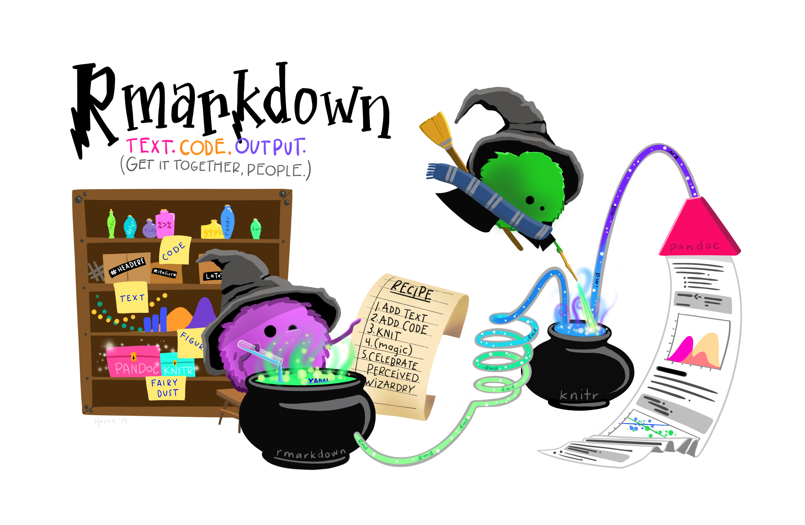
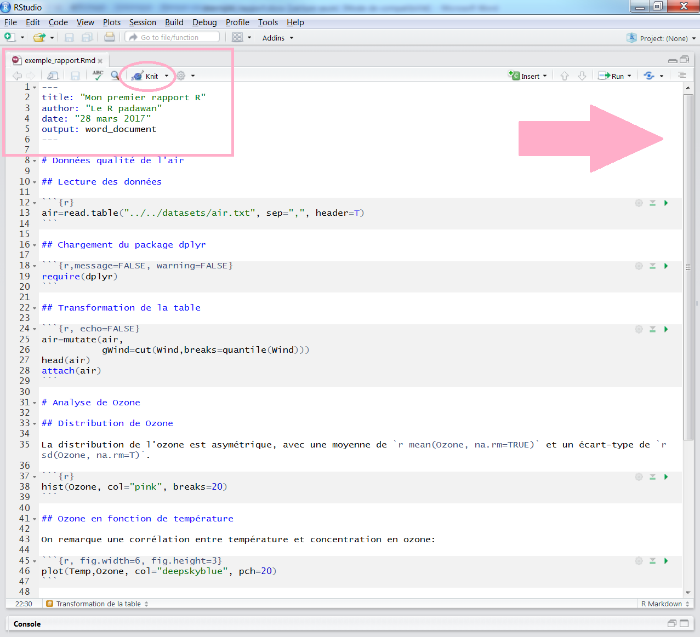
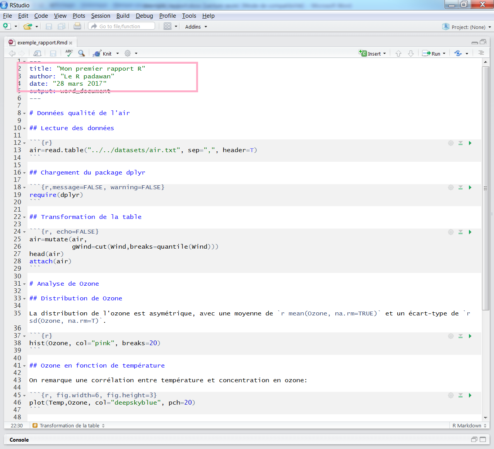
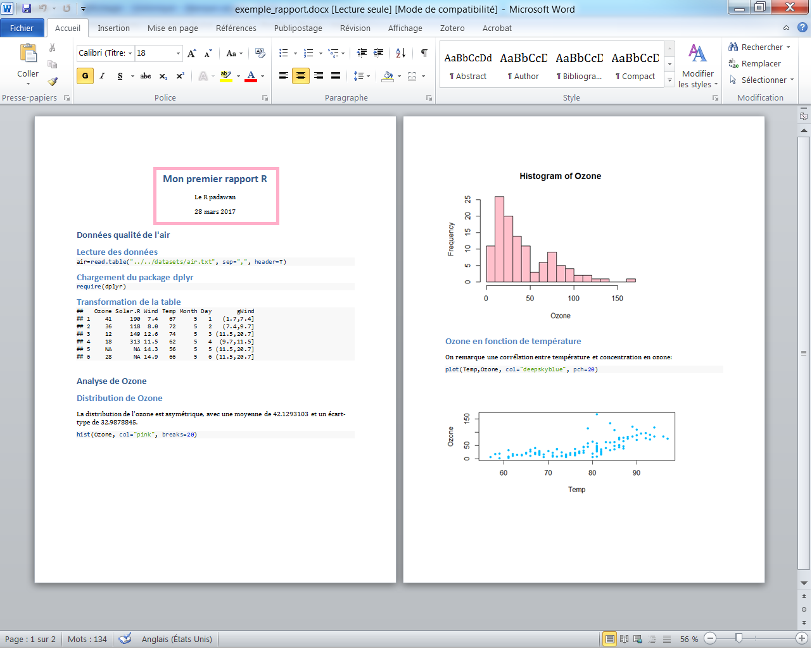
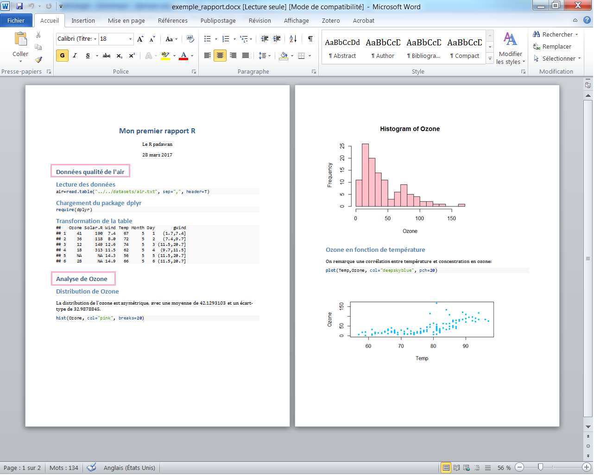
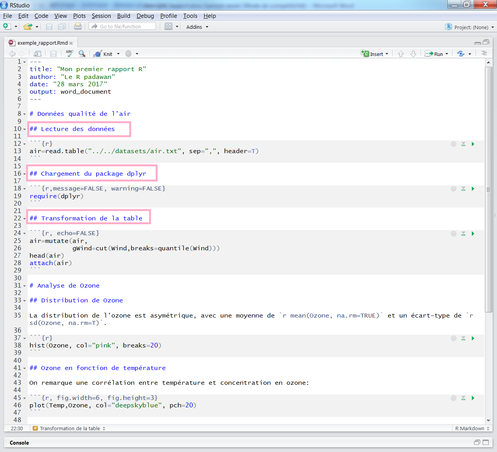
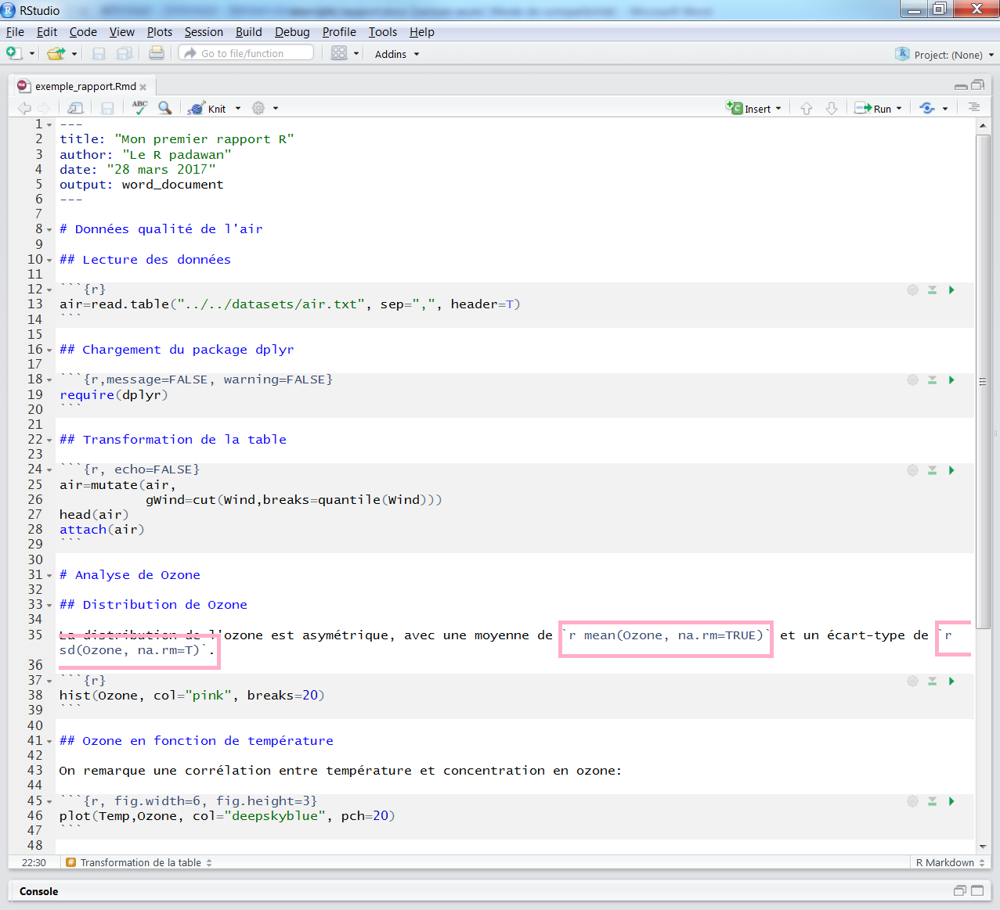
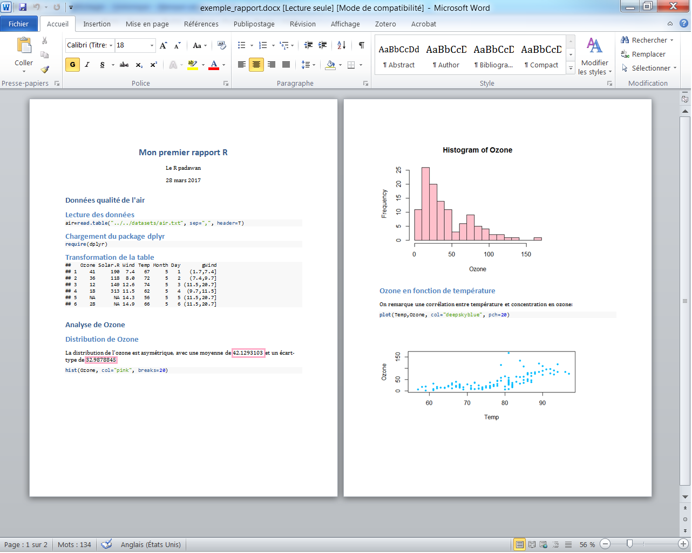

```{r,echo=FALSE, message=FALSE, warning=FALSE}
options(width=50)

knitr::opts_chunk$set(comment = NA)
```

# Reproductibilité

<table><td>

{width=750px}

**Reproductibilité de la recherche**:

faculté à reproduire à l'identique à partir de mêmes observations un résultat scientifique, par ex.: 

- un résultat statistique
- un graphique
- un modèle et ses simulations
- un rapport

</td>
<td>

La reproductibilité est facilitée par

- le recours à des traitements en **lignes de commande**
- la **documentation** du processus
- l'utilisation d'**un seul outil** pour l'ensemble du processus

{width=850px}

</td>
</table>

# Répertoire de travail et chemins

<table><tr><td>

Le **répertoire de travail** correspond au **dossier de votre ordinateur où, sauf précision de votre part, R lit et écrit les fichiers**.

<small>Si vous **ouvrez R ou RStudio directement** en double-cliquant sur leur icône, le répertoire de travail correspondra à un dossier défini "par défaut" sur votre poste de travail (par exemple chez moi "/home/lvaudor").
</small>
</td>
<td>

Vous pouvez 

- modifier le répertoire de travail à la main, au coup par coup (via la commande `setwd()`: attention ce n'est pas l'approche recommandée!!) ou bien 
- faire en sorte que chacun de vos **projets** corresponde à **son propre répertoire de travail**.

{width=850px}
</td>
</tr></table>

# Projets : un projet RStudio <=> un dossier

<table><tr><td>

`r emo::ji("mag_right")`[présentation des projets par RStudio](https://support.rstudio.com/hc/en-us/articles/200526207-Using-Projects)

Idéalement, un **projet** d'étude devrait correspondre à un **projet RStudio**, qui devrait correspondre à un **dossier** sur votre ordinateur...


</td><td>

Pour une question d'organisation, il est souhaitable que ce dossier comprenne l'**ensemble des éléments nécessaires à la conduite de votre projet** (traitements et rapport confondu)

- le rapport **Rmd** (nous en parlerons un peu plus tard)
- les **données** à **importer**
- les **données exportées** (résultats intermédiaires ou finaux de vos traitements)
- les **figures**
- les **scripts** nécessaires à vos traitements
- etc.


</td></tr></table>

# Projets: création

<table><tr><td>
Pour **créer** un nouveau projet RStudio, il suffit d'aller dans RStudio et cliquer sur **File  -> New Project**... 

Vous avez alors le choix entre:

- créer un projet correspondant à un **dossier existant** sur votre ordinateur
- créer un projet correspondant à un **nouveau dossier** (dans ce cas,  le dossier est créé sur votre ordinateur)
- créer un projet à partir d'un projet existant sur un dépôt distant de contrôle de version (**version control repository**) (par exemple gitHub)

</td><td>

Un fichier d'extension **.RProj** est alors créé dans le dossier en question.

Pour réouvrir le projet par la suite, il vous suffira:

- soit de double-cliquer sur ce fichier d'extention .Rproj, 
- soit de l'ouvrir via le menu RStudio File -> Open Project

</td></tr></table>

# Projets

Les **avantages** au travail en projet sont liés à

<table><tr><td>
la gestion des **chemins** et du **répertoire de travail**

<small>Par défaut, à l'ouverture d'un projet, le **répertoire de travail par défaut** est défini comme étant le dossier lié au projet. Cela veut dire que vous pouvez vous contenter de définir les chemins de manière relative **à partir de ce dossier** et qu'ils resteront valables sur un autre ordi/si vous déplacez le dossier (à partir du moment où la structure interne du dossier reste inchangée bien sûr).</small>

</td><td>

la praticité en terme de "**workflow**" (notamment si vous travaillez sur plusieurs projets en même temps)

<small>Travailler sur un projet vous permet de retrouver dans l'éditeur RStudio les **derniers fichiers que vous avez édité** et relatifs à ce projet en particulier, dans un **encodage correct**, de sauvegarder l'environnement **.Rdata** si vous le souhaitez, etc.</small>

</td></tr></table>

# Rapports

{width=1000px}

# Rapports: layout

<table><tr><td>


</td><td>

</td></tr></table>

# Rapports : Tricoter un .Rmd en .docx, .html, .pdf



# Rapports : Tricoter un .Rmd en .docx, .html, .pdf



# Rapports: Premier niveau de titre


# Rapports: Premier niveau de titre



# Rapports: Deuxième niveau de titre



# Rapports: Deuxième niveau de titre


# Rapports : Chunks de code


# Rapports : Chunks de code


# Rapports : Chunks de code muets


# Rapports : Chunks de code muets


# Rapports : Chunks de code incrustés



# Rapports : Chunks de code incrustés



# Rapports: Chunks graphiques


# Rapports: Chunks graphiques


# On récapitule!

<table><tr><td style="width: 30%">

</td><td style="width: 70%">

- **Projets** 
  + **arborescence** du dossier, 
  + robustesse du **chemin relatif**, 
  + conservation des **paramètres du projet** (par ex. l'encodage des scripts ou .Rmd)
  + contrôle de version
- **Rapports**
  + workflow, reproductibilité
  + formats de sortie
  + tricotage et **paramètres** des **chunks de code**
</td></tr></table>

