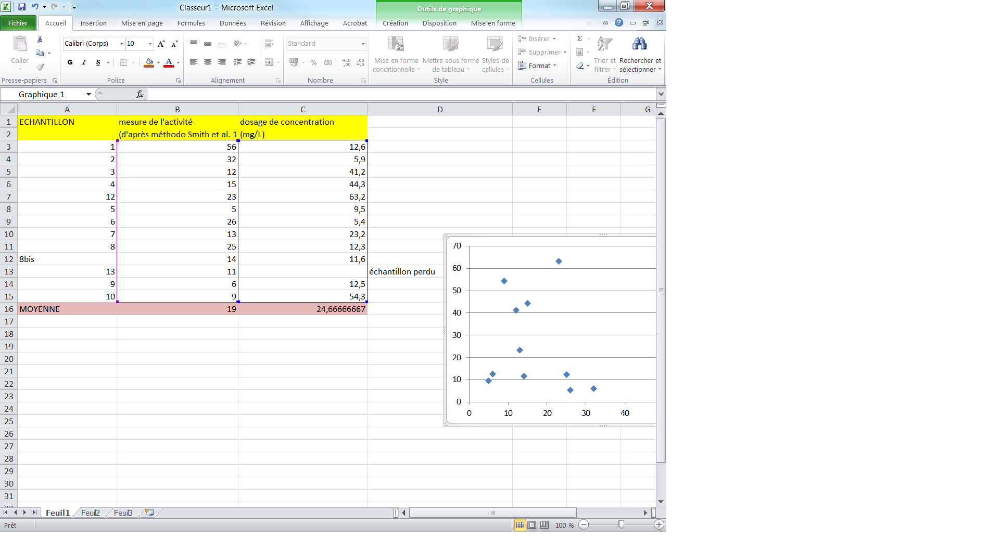
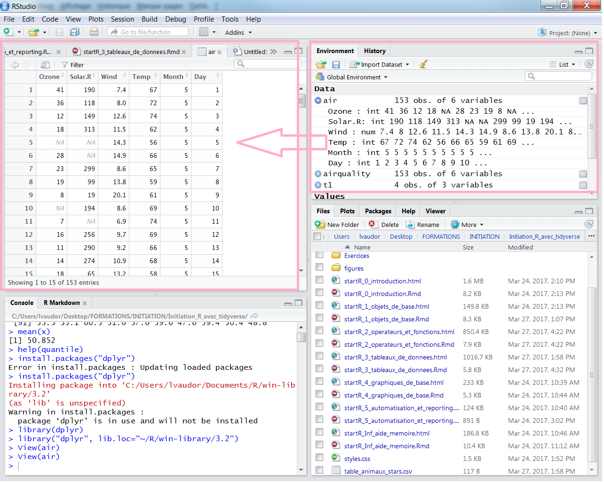

```{r setup, echo=FALSE, warning=FALSE, message=FALSE}
library(readr)
library(dplyr)
options(width=60)
knitr::opts_chunk$set(comment = NA)
catdata <- read.csv("../datasets/catdata.csv", sep=";")
```

# Lecture de tables: trouver son fichier!


<table><tr><td>

Pour **lire un tableau de données** il faudra indiquer le chemin du fichier...

Si vous travaillez sous forme de **projets .Rproj** alors le plus simple est d'indiquer le chemin **relatif** par rapport au **dossier racine** (celui qui contient le .Rproj). 

</td>
<td>

<small> Notez l'usage des slashs (/) et non d'antislashs, quel que soit votre système d'exploitation. </small>

Par exemple,

```{r}
path="data/data_brute/supertableau.csv"
```

<small>Si pour une raison ou une autre vous avez besoin de **remonter** dans l'arborescence des fichiers (c'est généralement non recommandé mais ça peut arriver), vous pouvez le faire avec "../".

Par exemple "../../donnees_hydro" vous fait remonter de deux niveaux dans l'arborescence avant de vous faire redescendre dans un dossier "donnees_hydro".
</small>

Vous pouvez également utiliser la fonction `file.path()` pour écrire votre chemin:

```{r}
path=file.path("data","data_brute","supertableau.csv")
path
```

</td>
</tr></table>

# Lecture de tables: Fonctions read_csv() ou read_delim()

<table><td>
Examinons la commande suivante:

```{r, echo=TRUE}
catdata <- readr::read_delim(file.path(file.path("..","datasets","catdata.csv")),
                             delim=";")
head(catdata,3)  # 3 premieres lignes du tableau
```

</td><td>
<small>
Notez que le format csv correspond à des valeurs séparées par une virgule ("csv"= **C**oma **S**eparated **V**alues).

Pour lire une table qui comprendrait un type de séparateur différent (par exemple, un espace, ou un point-virgule), on peut utiliser la fonction `read_delim()`.
</small>
</td></table>


# Jeu de données illustratif

<table><td>

Dans la suite de ce document nous allons utiliser un jeu de données `catdata` comprenant un certain nombre de variables relatives à des chats.

<small> Il s'agit de données fictives, créées de toute pièce dans un but pédagogique... </small>

```{r}
catdata <- readr::read_delim(file.path("..","datasets","catdata.csv"), delim=";")
catdata
```
</td><td>
Les variables de ce jeu de données sont les suivantes:

- **haircolor**: la couleur du poil (catégoriel)
- **hairpattern**: le "pattern" coloré du poil (catégoriel)
- **sex**: le sexe du chat (catégoriel)
- **weight**: son poids (quantitatif)
- **age**: son âge (quantitatif)
- **foodtype**: le type d'alimentation (catégoriel)
</td></table>


# Nettoyer ses données

Attention, **utilisateurs de tableurs**, cette diapo est pour vous... 

Si vous avez des difficultés à lire votre tableau des données, c'est sans doute parce que celui-ci n'est pas un tableau de données **brutes**.

<table><tr><td>

Pour lire un tableau de données sous R, il convient d'abord de **nettoyer ce tableau**:

- Vérifier que les noms de colonnes ne contiennent pas de **caractères spéciaux ou des espaces**, avoir des noms de variables **courts** mais **explicites**
- Vérifier si certains champs correspondent en fait à des **commentaires**, si votre tableur contient des **graphiques**, etc.. 

</td><td>



</td></tr></table>

# Tidy data

{width=1200px}

# Tidy data

{width=1200px}


# Lecture de tables: en passant par RStudio

On peut également utiliser les **fonctionnalités de RStudio** pour afficher et modifier la table.

<table><tr><td>


</td><td>

</td></tr></table>

# Ecriture de tables: Fonction write.table()

```{r, echo=FALSE}
t1 <- tibble::tibble(Espece=c("Chien","Dauphin","Chat","Eponge"),
             Nom <- c("Lassie","Flipper","Garfield","Bob"),
             Date <- c(1940,1964,1978,1999))
```

<table><tr><td>
A l'inverse, il est possible d'écrire des fichiers depuis R. Pour écrire une table, par exemple:

```{r}
t1
readr::write_csv(t1,
          "datasets/table_animaux_stars.csv")
```

</td><td>
Cette-fois les arguments principaux sont:

- **x**: l'objet tibble à écrire
- **file**: le nom de fichier de votre choix (ou chemin, si vous ne souhaitez pas écrire le fichier *directement* dans le répertoire de travail)
</td></tr></table>

# Structure et dimensions d'une table

<table><tr><td>

```{r}
str(catdata) # structure du tableau
colnames(catdata) # nom des colonnes
``` 

```{r}
dim(catdata) # dimensions
nrow(catdata) # nombre de lignes
ncol(catdata) #nombre de colonnes

```


</td><td>

Pour afficher les **premières lignes** du tableau:
```{r}
head(catdata)
```

Pour afficher les **dernières lignes** du tableau:
```{r}
tail(catdata)
```
</td></tr></table>

# RStudio view data



```{r include=FALSE, results=FALSE}
library(dplyr)
```


# dplyr: Introduction()

<table><tr><td>

**dplyr** est un package qui permet de faire simplement diverses opérations sur les tableaux de données:

- `select()` permet de **sélectionner des variables** (colonnes)
- `filter()` permet de **filtrer les individus** (lignes)
- `arrange()` permet de **réarranger le tableau selon l'ordre des variables**
- `mutate()` permet de **créer et ajouter de nouvelles variables** (colonnes)
- `summarise()` permet de **résumer plusieurs valeurs en une seule** 

</td><td>

</td></tr></table>


# dplyr: select()

<table><tr><td>


**select()** permet de **sélectionner des variables**

Par exemple, on peut sélectionner des variables de la table `air`

```{r}
head(catdata)
```


</td><td>

- en spécifiant les **noms** ou **numéros** des variables à **conserver**
```{r}
data <- select(catdata,weight, age)
head(data,2)
data <- select(catdata,4,5)
head(data,2)
```

- en spécifiant le **nom** ou les **numéros** des variables à **écarter** avec le signe **-**

```{r}
data <- select(catdata,-hairpattern,-haircolor)
head(data,2)
```
</td></tr></table>


# dplyr: select()


<table><tr><td>


**select()** permet de **sélectionner de multiples variables**, en passant par la notation `var_1:var_n` 

```{r}
head(catdata)
data <- select(catdata,sex:foodtype)
head(data)
```


ou encore en passant par des **fonctions auxiliaires**. On peut citer par exemple:

- `starts_with` pour les variables qui **commencent** par un texte donné
- `ends_with` pour les variables qui **terminent** par un texte donné
- `contains` pour les variables qui **contiennent** un texte donné
- etc.

</td><td>
Par exemple:

```{r}
data <- select(catdata,starts_with("hair"))
head(data)
```
</td></tr></table>

# dplyr: filter()

<table><tr><td>


**filter()** permet de **filtrer les lignes du tableau** en fonction des valeurs de telle ou telle variable.

Ici, par exemple, on cherche toutes les lignes qui correspondent au mois de juillet:

```{r}
data <- filter(catdata,haircolor=="red")
nrow(data)
head(data)
```

</td><td>

On peut **combiner plusieurs conditions logiques** (ET logique, par une virgule ou un &, OU logique, par l'opérateur |).

Par exemple,

- pour ne conserver que les lignes qui telles que age>10 **et** weight>5:

```{r}
data <- filter(catdata, age>10, weight>5)
data
```

- pour ne conserver que les lignes telles que haircolor soit "red" ou "black":

```{r}
data <- filter(catdata, haircolor=="red"|haircolor=="black")
nrow(data)
```
Vous pouvez également utiliser l'opérateur `%in%`:

```{r}
data <- filter(catdata, haircolor %in% c("red","black"))
nrow(data)
```
</td></tr></table>

# dplyr: arrange()

<table><tr><td>


Pour réarranger un tableau selon l'ordre d'une variable, on peut faire appel à la fonction `arrange` (ici, par exemple on réordonne `catdata` selon l'ordre croissant de `age` et `weight`):

```{r}
data <- arrange(catdata,age, weight)
head(data)
```

</td><td>

et pour ordonner par ordre décroissant, on utilise **desc()**:

```{r}
data <- arrange(catdata,desc(age))
head(data)
```
</td></tr></table>

# dplyr: mutate()

<table><tr><td>


Pour créer de nouvelles variables et les ajouter au tableau de données on peut utiliser la fonction **mutate()**.


Voici par exemple comment procéder si je souhaite créer une nouvelle variable, `age_humain`, à partir de `age`:

```{r}
data=mutate(catdata,
            age_humain=age*7)
head(data)
```


</td><td>

Je peux créer une nouvelle variable `hair` en collant `haircolor` et `hairpattern`

```{r}
data <- mutate(catdata,
               hair=paste(haircolor,"-",hairpattern,sep=""))
head(data)
```

Si je **réutilise un nom de colonne** déjà présent dans la table, la colonne est "écrasée":

```{r}
data <- mutate(catdata,
               age=age*7)
head(data)
```


</td></tr></table>


# dplyr: mutate() et auxiliaires... case_when()

<table><td>


</td><td>
On peut effectuer une transformation de manière **conditionnelle** à l'aide de la fonction `case_when()`

Par exemple:

```{r}
data <- mutate(catdata,
               classe_age=case_when(age>10~"old",
                                    age>5 & age<=10~"medium",
                                    age<=5~"young"))
data
```

On peut également simplifier l'écriture de la condition complémentaire (ici `age<=5`) en la remplaçant par `TRUE`:

```{r}
data <- mutate(catdata,
               classe_age=case_when(age>10~"old",
                                    age>5 & age<=10~"medium",
                                    TRUE~"young"))
```


</td>
</table>

# dplyr: summarise()


<table><tr><td>


Si l'on souhaite calculer quelques **statistiques** un peu basiques sur un jeu de données, on peut utiliser la fonction **summarise()**.


Par exemple:

```{r}
data <- summarise(catdata,
                  mean_age=mean(age),
                  nb_patterns=n_distinct(hairpattern),
                  nb_Mesures=n())
data
```


</td><td>

Et surtout, si je souhaite calculer une statistique pour **différents groupes** (définis ici, par exemple, par la variable `Month`), je vais le spécifier dans l'argument spécifiant la table de données, à l'aide de **group_by()**:

```{r}
data <- summarise(group_by(catdata,foodtype),
                  mean_age=mean(age),
                  nb_Mesures=n())
data
```

</td></tr></table>
  
# dplyr: Chaînage

Vous avez vu que les fonctions de `dplyr` permettaient de faire toutes sortes d'opérations sur les tableaux de données. Il est bien entendu possible de les **combiner** pour réaliser des opérations complexes...

<table><tr><td  style="width: 30%">
Imaginons par exemple que l'on souhaite répondre à une question telle que 

"Quelle est le **poids moyen** des chats de **plus de 10 ans** en **fonction de leur type de nourriture**"

</td><td  style="width: 70%">
Pour répondre à cette question, je pourrais par exemple (il y a en fait plusieurs possibilités):

- **filtrer** pour ne garder que les chats de plus de 10 ans
- **grouper** par type de nourriture
- **résumer** l'information en  **moyenne de poids** 
</td></tr></table>

# dplyr: Chaînage

<table><tr><td style="width: 40%">
Classiquement, pour coder cette chaîne d'opérations sous R, on procéderait de la manière suivante:

```{r}
data1 <- filter(catdata, age>10)
data2 <- group_by(data1, foodtype)
data3 <- summarise(data2,
                   mean_weight=mean(weight),
                   .groups="drop") 
```

</td><td style="width: 60%">
{width=100%}

</td></tr></table>

# dplyr: Chaînage

<table><tr><td  style="width: 40%">
Si je souhaitais réaliser cet enchaînement de commandes en **une seule opération**, et ainsi **éviter la création d'objets intermédiaires** data1, data2, etc., voici (classiquement) comment il faudrait procéder:

```{r}
data <-summarise(group_by(filter(catdata,
                          age>10),
                 foodtype),
          mean_weight=mean(weight),
          .groups="drop")
data
```

</td><td style="width: 60%">
{width=100%}
</td></tr></table>

# dplyr: Chaînage

<table><tr><td>

`dplyr` permet d'inverser l'ordre de cette syntaxe en permettant d'utiliser un opérateur (l'opérateur "pipe") qui s'écrit de la manière suivante : **%>%** et que l'on pourrait (en gros) traduire par **"et puis"**...

Voyez plutôt comment le code ci-dessus peut être simplifié par l'usage de cet opérateur:

```{r}
data <- catdata %>%
  filter(age>10) %>% 
  group_by(foodtype) %>% 
  summarise(mean_age=mean(age))
```

</td><td>
{width=60%}
</td></tr></table>

# dplyr: summarise() et auxiliaires... across()

<table><td>
{width=100%}
</td>
<td>
```{r across}
summary_by_hair=catdata %>% 
  group_by(haircolor,hairpattern) %>% 
  summarise(across(where(is.numeric),mean),
            .groups="drop")
summary_by_hair
```
</table>

# Allonger/ élargir ses tableaux

<table><td>
Le principe des "tidy data" est le suivant:

- une **ligne** = une **observation**
- une **colonne** = une **variable**


Mais dans certains cas, la **définition** même des observations et des variables peut être **fluctuante** en fonction de l'analyse qu'on souhaite réaliser.
</td>
<td>

<small>Considérons par exemple la table suivante, où chaque ligne correspond à l'observation d'**un poisson au niveau d'une station de mesure**: </small>

```{r, echo=FALSE}
library(tidyr)
head(fish_encounters, nrow=5)
```

<small>
On pourrait aussi considérer qu'une observation correspond à **un poisson donné**, et les différentes variables aux **différentes stations de mesure**:
</small>
```{r, echo=FALSE}
fish_encounters %>%
  pivot_wider(names_from = station, values_from = seen, values_fill = 0) %>% 
  head(nrow=5)
```

Ici, on a "élargi" le tableau à l'aide de la fonction `pivot_wider()` du package `tidyr`
</td>
</table>


# Elargir ses tableaux avec pivot_wider: 


<table><tr><td>
```{r pivot_wider_long}
library(tidyr)
fish_encounters
```
</td><td>
```{r pivot_wider_wide}
fish_wide=fish_encounters %>% 
    pivot_wider(names_from = station,
                values_from = seen,
                values_fill = 0,
                names_prefix="st_")
fish_wide
```
</td></tr></table>

# Allonger ses tableaux avec pivot_longer: 


<table><tr><td>
```{r pivot_longer_wide}
library(tidyr)
fish_wide
```
</td><td>
```{r pivot_longer_long}
fish_long=fish_wide %>% 
    pivot_longer(cols=starts_with("st_"),
                 names_to = "station",
                 values_to="seen")
fish_long
```
</td></tr></table>

# On récapitule!

<table><tr><td style="width: 30%">

</td>

<td style="width: 30%">


- **chemins**, répertoires de travail
- **lecture**/écriture de **tables** (nature du séparateur de colonnes, du séparateur décimal)
- description sommaire & affichage de tables
- manipulation de tables avec dplyr
  + sélection de variables (**select**)
  + filtre des lignes (**filter**)
  + tri des lignes (**arrange**)
  + transformation des colonnes (**mutate**)
  + agrégation de l'information (**summarise**)
- chaînage des instructions avec le **pipe** : **%>%**
</td></tr></table>

