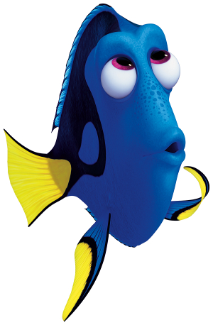

```{r setup, echo=FALSE, message=FALSE, warning=FALSE}
options(width=60)

knitr::opts_chunk$set(comment = NA)
```

# Introduction

<table><td>

`ggplot2` est un package utilisé pour réaliser des graphiques selon des principes qui lui sont propres.

<small>(en l'occurrence, ces principes sont inspirés du livre "The **G**rammar of **G**raphics" de Leland Wilkinson, d'où le `gg` de `ggplot`).</small>

`ggplot2` se distingue des autres outils de production graphique sous R, et notamment des fonctions graphiques "de base" comme "hist", "boxplot", etc. par son principe général qui est de **décrire** et donc **produire** un **graphique** comme un **assemblage de couches**

=> production **simple** et **intuitive** de graphiques **beaux** et **riches**


</td><td>

{width=800px}
</td></table>

# Introduction

<table><td>

Commençons par charger le package `ggplot2` -après l'avoir, si nécessaire, installé- :

```{r, message=FALSE, warning=FALSE}
library(ggplot2)
```


```{r,include=FALSE}
library(grid)
library(gridExtra)
```

<td>
**Jeu de données illustratif**

Pour vous illustrer les principes et résultats graphiques du package `ggplot2`, je vais réutiliser le jeu de données `catdata`:

```{r}
catdata <- read.csv("../datasets/catdata.csv", sep=";")
head(catdata)
```

</td></table>


# Les bases: jeu de données, aethetics, et geoms

<table><td>
On **crée** un graphique à l'aide de la fonction **ggplot**. On 
spécifie sur quel **jeu de données** le graphique va être construit, ainsi que les **aesthetics** x et y:

```{r, fig.width=6, fig.height=4}
p <- ggplot(data=catdata,
            mapping=aes(x=haircolor,y=weight))
plot(p)
```

</td><td>


<small>On peut simplifier l'écriture de cette commande en omettant de préciser les noms des arguments `data` et `mapping`, et afficher directement le graphique (sans lui assigner un nom, ici `p`):</small>

```{r, fig.width=6, fig.height=4}
ggplot(catdata,
       aes(x=haircolor,y=weight))
```
</td></table>

# Geom

<table><td>


On peut par exemple de représenter l'information à l'aide d'un **geom "point"**:

```{r, fig.width=6, fig.height=4}
ggplot(catdata,aes(x=haircolor,y=weight)) +
  geom_point()
```


Si je souhaite réaliser un graphique de type **boxplot** plutôt que point alors il faudra que je modifie la fonction `geom()` que j'utilise...

</td><td>

## Remarque

Vous devez choisir un **type de geom compatible avec la nature des informations** (en x et y) que vous voulez représenter!

```{r, fig.width=6, fig.height=4, error=TRUE}
ggplot(catdata,aes(x=haircolor)) +
  geom_point()
```
</td></table>

# Types de geom

<table><td>
## Graphique univarié, x discrète

```{r, fig.width=6, fig.height=4}
ggplot(catdata,aes(x=haircolor)) +
  geom_bar()
```

</td><td>  

## Graphique univarié, x continue

```{r, fig.width=6, fig.height=4, message=FALSE, warning=FALSE}
ggplot(catdata,aes(x=weight)) +
  geom_histogram()
```
</td></table>


# Modification du type de geom

<table><td>

## Bivarié, x et y continues
```{r, fig.width=6, fig.height=4}
ggplot(catdata,aes(x=age, y=weight)) +
  geom_point()
```

</td><td>
## Bivarié, x et y continues
```{r, fig.width=6, fig.height=4}
ggplot(catdata,aes(x=age, y=weight)) +
  geom_bin2d()
```
</td></table>


# Modification du type de geom

<table><td>
## Bivarié, x discrète et y continue
```{r, fig.width=6, fig.height=4}
ggplot(catdata,aes(x=haircolor, y=weight)) +
  geom_boxplot()
```

</td><td>
## Bivarié, x discrète et y continue
```{r, fig.width=6, fig.height=4}
ggplot(catdata,aes(x=haircolor, y=weight)) +
  geom_violin()
```
</td></table>


# Superposition de geoms

<table><td>
```{r, fig.width=6, fig.height=4}
ggplot(catdata, aes(x=haircolor, y=age))+
  geom_point(col="blue", size=2) +
  geom_jitter(col="pink", size=2)
```
</td></table>


# Paramétrisation du geom

<table><td>

Evidemment tous **les geoms peuvent être paramétrés**. Je peux par exemple modifier la couleur de mes boîtes à moustache de la façon suivante:


```{r, fig.width=6, fig.height=4}
ggplot(catdata,aes(x=haircolor,y=weight)) +
  geom_boxplot(fill="lightskyblue")
```

</td><td>
Parmi les arguments les plus utilisés pour paramétrer les geoms, on peut citer: 

- **color**: la couleur des lignes
- **fill**: la couleur de remplissage
- **linetype**: le type de ligne
- **size**: la taille des symboles ou l'épaisseur des lignes
- **alpha**: la transparence
</td></table>

# Paramétrisation du geom

<table><td>
```{r, fig.width=6, fig.height=4}
ggplot(catdata, aes(x=age, y= weight)) +
  geom_point(shape=24,
             color="blue",
             fill="lightskyblue",
             alpha=0.6,
             size=3)
```

</td><td>
```{r, fig.width=6, fig.height=4}
ggplot(catdata, aes(x=age)) +
  geom_density(color="red",
               fill="pink",
               linetype=3,
               lwd=2)
```
</td></table>


# On récapitule!

<table><td style="width: 30%">

</td><td style="width: 70%">

- **principes** du package **ggplot2**, construction d'un graphique par "couches"
- représentation de l'information par des **geoms**
- exploration de **divers geoms** (**geom_point**, **geom_boxplot**, geom_violin, geom_density, **geom_bar**, **geom_histogram**, geom_jitter, geom_bin2d, etc.)
- **paramétrisation** des geoms (**color**, **fill**, **shape**, alpha, **size**, lwd, linetype etc.)
</td></table>


# Relier paramètres graphiques et variables: mapping

<table><td>
Nous avons vu comment définir les paramètres des geoms de manière "absolue". Par exemple:

```{r, fig.width=6, fig.height=4}
ggplot(catdata,
       mapping=aes(x=haircolor, y=weight)) +
  geom_boxplot(fill="lightskyblue")
```

</td><td>
Je peux aussi **lier** un paramètre graphique à une variable. On appelle ce procédé **mapping**. 

Cette variable fait alors partie des **aesthetics**.

```{r, fig.width=6, fig.height=4}
ggplot(catdata,
       mapping=aes(x=haircolor,y=weight)) + 
  geom_boxplot(mapping=aes(fill=haircolor))

```
</td></table>

# Relier paramètres graphiques et variables: mapping

<table><td>
On peut utiliser en aesthetic des variables autres que celles qui définissent x et y... Cela veut dire que l'on peut très simplement **rajouter des couches d'information** (et les **légendes** correspondantes!) au graphique.

</td><td>
```{r, fig.width=6, fig.height=4}
ggplot(catdata,aes(x=haircolor,y=weight)) + 
  geom_boxplot(aes(fill=sex))
```
</td></table>

# Esthétique propre à un geom vs esthétique propre à un graphique

Remarquez que l'esthétique `fill=sex` peut être spécifiée à la fois dans l'appel à `geom_boxplot()` et l'appel à `ggplot()` elle-même

<table><td>

```{r,fig.width=6, fig.height=4}
ggplot(catdata,aes(x=haircolor,y=weight)) + 
  geom_boxplot(aes(fill=sex))
```

</td><td>
```{r, fig.width=6, fig.height=4}
ggplot(catdata,aes(x=haircolor,y=weight, fill=sex)) + 
  geom_boxplot()
```

</td></table>

# Esthétique propre à geom vs esthétique propre à graphique

Cependant l'endroit où l'esthétique est spécifiée peut avoir un effet quand le graphique comprend plusieurs couches:

<table><td>

```{r, fig.width=6, fig.height=4}
ggplot(catdata,aes(x=haircolor,y=weight)) + 
  geom_boxplot(aes(fill=sex))+
  geom_point(shape=24,size=2)
```

</td><td>
```{r, fig.width=6, fig.height=4}
ggplot(catdata,aes(x=haircolor,y=weight, fill=sex)) + 
  geom_boxplot() +
  geom_point(shape=24,size=2)
```
</td></table>

# Facettes (en lignes)

<table><td>
```{r, fig.width=8, fig.height=8, fig.show="hide", fig.path="figures/",label="facettes"}
ggplot(catdata, aes(x=foodtype, y=age)) +
  geom_boxplot(aes(fill=foodtype)) + 
  facet_grid(rows=vars(hairpattern))
```

</td><td>


</td></table>

# Facettes (en colonnes) 

<table><tr><td>
```{r, fig.width=8, fig.height=4, fig.show="hide", fig.path="figures/",label="facettes2"}
p <- ggplot(catdata, aes(x=foodtype, y=age)) +
  geom_boxplot(aes(fill=foodtype))  
pf=p+facet_grid(cols=vars(haircolor))
plot(pf)
```

</td><td>

</td></tr></table>

# Facettes (en grille)

<table><tr><td>
```{r, fig.width=8, fig.height=8, fig.show="hide", fig.path="figures/",label="facettes3"}
p <- ggplot(catdata, aes(x=foodtype, y=age)) +
  geom_boxplot(aes(fill=foodtype))  
pf=p+facet_grid(rows=vars(hairpattern),
                cols=vars(haircolor))
plot(pf)
```

</td><td>

</td></tr></table>

# Facettes (libres)

<table><tr><td>
```{r, fig.width=8, fig.height=8, fig.show="hide", fig.path="figures/",label="facettes4"}
p <- ggplot(catdata, aes(x=foodtype, y=age)) +
  geom_boxplot(aes(fill=foodtype))  
pf=p+facet_wrap(vars(hairpattern))
plot(pf)
```
</td><td>

</td></tr></table>


# Titres des axes

<table><td>
`ggplot2` offre également des outils pour travailler facilement sur les problèmes de titres, d'échelles et d'axes.

</td><td>
```{r, fig.width=6, fig.height=4}
ggplot(catdata, aes(x=foodtype, y=age)) +
  geom_boxplot(aes(fill=foodtype)) + 
  labs(x="type de nourriture",
       y="âge")
```
</td></table>


# Echelles des axes

Un des aspects les plus intéressants de `ggplot2` est la facilité avec laquelle on peut transformer les variables de position x et y.

<table><td>
## sans transformation d'échelle
```{r, fig.width=6, fig.height=4}
p <-ggplot(catdata, aes(x=foodtype, y=age)) +
  geom_boxplot(aes(fill=foodtype)) + 
  labs(x="type de nourriture",y="âge")
plot(p)
```

</td><td>
## avec transformation d'échelle
```{r, fig.width=6, fig.height=4}
p_log <- p +
  scale_y_log10(breaks=seq(2,17,by=2))
plot(p_log)
```
</td></table>

# Limites des axes

On peut également définir des limites d'axes

<table><td>
## sans limites d'axes
```{r, fig.width=6, fig.height=4}
p <- ggplot(catdata, aes(x=foodtype, y=age)) +
  geom_boxplot(aes(fill=foodtype)) + 
  labs(x="type de nourriture",
       y="âge")
plot(p)
```

</td><td>
## avec limites d'axes
On peut également définir des limites d'axes

```{r, fig.width=6, fig.height=4}
p_lims <- p + 
  scale_y_continuous(limits=c(0,20))
plot(p_lims)
```
</td></table>

# Etiquettes des axes

<table><td>

Ou définir les endroits où les barres s'affichent sur l'axe (argument **breaks**), ainsi que les étiquettes associées (argument **labels**). 

```{r, fig.width=6, fig.height=4, label="etiquettes_axes", fig.path="figures/", fig.show='hide'}
ggplot(catdata, aes(x=foodtype, y=age)) +
  geom_boxplot(aes(fill=foodtype)) + 
  labs(x="type de nourriture",
       y="âge") +
  scale_y_continuous(limits=c(0,20),
                     breaks=c(0,5,10,15),
                     labels=c("bébé","jeune","moyen","âgé")) +
  scale_x_discrete(labels=c("dry"="croquettes",
                            "wet"="pâtée",
                            "other"="autre"))
```


</td><td>


</td></table>

# Echelles colorées

<table><tr><td>

```{r}
p <-ggplot(catdata, aes(x=haircolor, y=weight, fill=haircolor))+
  geom_boxplot()+
  scale_fill_manual(values=c("black","brown","orange","white"))
plot(p)
```

</td><td>
```{r}
p <-ggplot(catdata, aes(x=age, y=weight, color=haircolor))+
  geom_point(size=2)+
  scale_color_manual(values=c("black","brown","orange","white"))
plot(p)
```
</td></tr></table>

# Echelles colorées

<table><tr><td>
```{r}
p <-ggplot(catdata, aes(x=hairpattern))+
  geom_bar(aes(fill=hairpattern))+
  scale_fill_brewer(palette="Purples")
plot(p)
```

</td><td>
```{r}
p <-ggplot(catdata, aes(x=age, y=weight))+
  geom_bin2d(binwidth=1)+
  scale_fill_gradient(low="yellow",high="green")
plot(p)
```
</td></tr></table>


# Thèmes

Les thèmes permettent de définir l'allure globale du graphique. On peut modifier le thème de la manière suivante :

<table><tr><td>
## classic
```{r, fig.width=6, fig.height=4}
p <- ggplot(catdata, aes(x=age, y=weight, color=haircolor)) +
  geom_point() +
  theme_classic()
plot(p)
```

</td><td>
## black & white
```{r, fig.width=6, fig.height=4}
p <- ggplot(catdata, aes(x=age, y=weight, color=haircolor)) +
  geom_point() +
  theme_bw()
plot(p)
```
</td></tr></table>

# Thèmes

Les thèmes permettent de définir l'allure globale du graphique. On peut modifier le thème de la manière suivante :

<table><tr><td>
## minimal
```{r, fig.width=6, fig.height=4}
p <- ggplot(catdata, aes(x=age, y=weight, color=haircolor)) +
  geom_point() +
  theme_minimal()
plot(p)
```


</td><td>
## grey
```{r, fig.width=6, fig.height=4}
p <- ggplot(catdata, aes(x=age, y=weight, color=haircolor)) +
  geom_point() +
  theme_grey()
plot(p)
```
</td></tr></table>


# Statistiques descriptives

<table><tr><td>
Le package `ggplot2` permet en outre de rajouter des informations provenant de **jeux de données supplémentaires**.

Cela permet par exemple de calculer des statistiques descriptives qui **résument l'information par groupe**. On peut évidemment passer par les fonctions de `dplyr` pour calculer ces statistiques!!

Par exemple, on peut rajouter un geom de type point qui nous informe sur les moyennes par groupes -définis pour la variable x, c'est à dire `haircolor`-. 

</td><td>
```{r, fig.width=6, fig.height=4, warning=FALSE, message=FALSE}
library(dplyr)
catdata_grouped1 <- catdata %>%
  group_by(haircolor) %>%
  summarise(meanweight=mean(weight),
            .groups="drop")

p <- ggplot(catdata,aes(x=haircolor,y=weight)) + 
  geom_boxplot(aes(fill=sex)) +
  geom_point(data=catdata_grouped1, aes(y=meanweight))
plot(p)
```
</td></tr></table>

# Statistiques descriptives

<table><tr><td>
On peut calculer une statistique en groupant les données **selon plusieurs variables**. Ici par exemple on combien les groupes données par la variable `haircolor` et par la variable `sex`:

```{r}
catdata_grouped2 <- catdata %>%
  group_by(haircolor,sex) %>%
  summarise(meanweight=mean(weight),
            .groups="drop")

p <- ggplot(catdata,aes(x=haircolor,y=weight)) + 
  geom_boxplot(aes(fill=sex)) +
  geom_point(data=catdata_grouped2,
             aes(y=meanweight, group=sex),
             position=position_dodge(width=0.75))
```

</td><td>

```{r, fig.width=6, fig.height=4}
plot(p)
```
</td></tr></table>


# Modèle de régression

<table><tr><td>
Le package `ggplot2` offre aussi des possibilités intéressantes pour travailler sur le lien entre **deux variables quantitatives** (modèles de **régression**):

```{r,  fig.width=6, fig.height=4}
p <- ggplot(catdata, aes(x=age,y=weight)) +
  geom_point(aes(col=sex)) +
  geom_smooth()
plot(p)
```

</td><td>
On ajoute une droite de régression avec la fonction `geom_smooth` (ici par défaut, régression de type loess). Allez voir le fichier d'aide associé à la fonction `geom_smooth` pour voir l'ensemble des paramètres de cette fonction...


Plus d'explications sur la régression loess [ici](http://perso.ens-lyon.fr/lise.vaudor/regression-loess/)
</td></tr></table>

# Modèle de régression

On peut préciser le modèle en précisant des aesthetics supplémentaires:

```{r,  fig.width=6, fig.height=4}
p <- ggplot(catdata, aes(x=age,y=weight,col=sex)) +
  geom_point() +
  geom_smooth()
plot(p)
```

# Modèle de régression linéaire

<table><tr><td>
Le type de régression réalisé est également paramétrable. Ici, par exemple, on réalise une régression linéaire:

```{r,  fig.width=6, fig.height=4}
p <- ggplot(catdata,
            aes(x=age,y=weight)) +
  geom_point(aes(col=sex))+
  geom_smooth(aes(group=sex),
              method="lm")
plot(p)
```


</td><td>
`ggplot2` permet de produire la **représentation graphique** du modèle de régression. Pour effectuer une régression et (par exemple récupérer ses coefficients), on passe par `lm()`:

```{r}
reg=lm(weight~age*sex, data=catdata)
summary(reg)
```


</td></tr></table>


# On récapitule!

<table><tr><td style="width: 30%">


</td><td style="width: 70%">

- **titres** du graphique, et des axes
- **échelles**, **limites** et **étiquettes** des axes
- **échelles colorées**
- **thèmes**
- **modèles stats**
</td></tr></table>