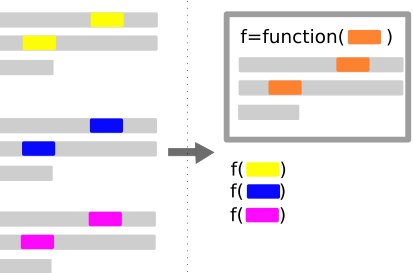
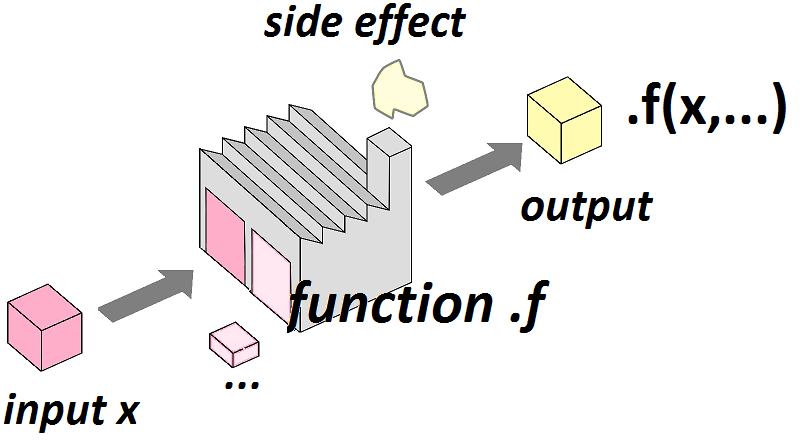
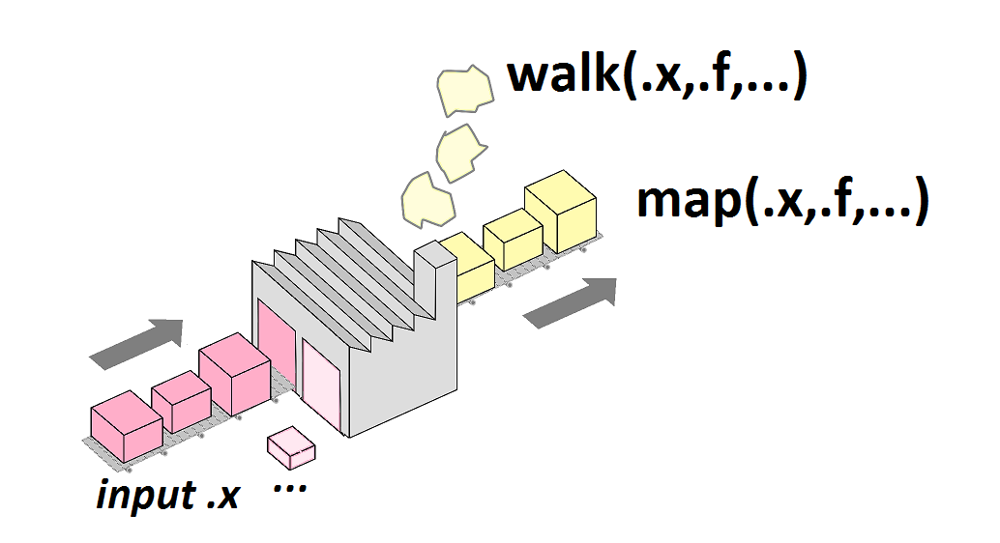
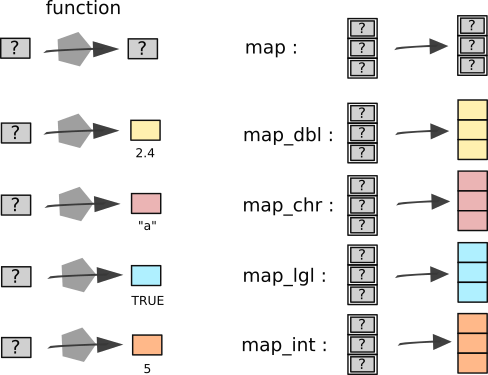
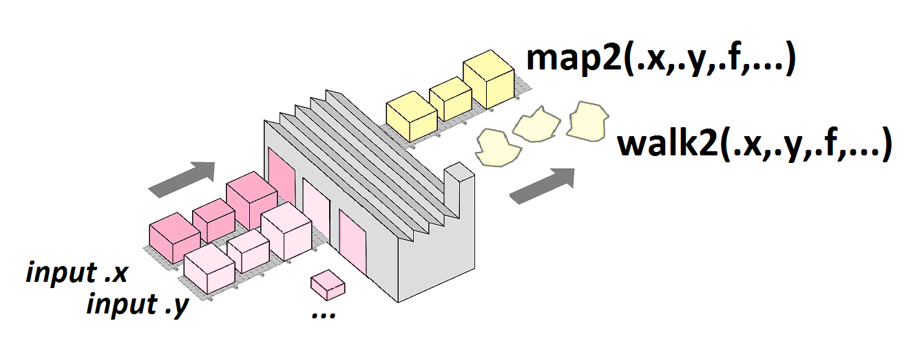
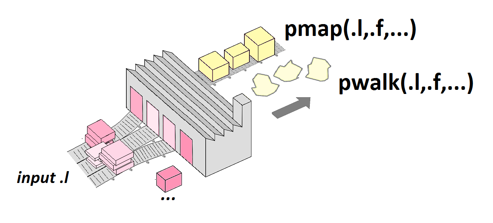
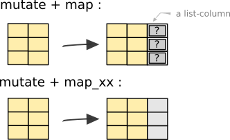
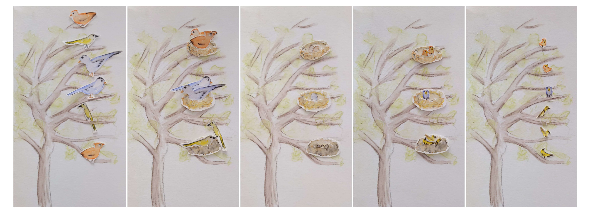

```{r, echo=FALSE, message=FALSE, warning=FALSE}
options(width=50)
library(tidyverse)
knitr::opts_chunk$set(echo = TRUE, message=FALSE, warning=FALSE,comment = NA)
air <- read_csv(file="datasets/air.txt")
```

# Quésako

La **programmation** doit vous permettre d'automatiser un certain nombre de traitements avec R, i.e. de décrire un certain nombre d'opérations similaires et les faire exécuter en lot par la machine.

La **programmation fonctionnelle** est une manière de réaliser cette automatisation des traitements, en raisonnant principalement sur l'écriture et l'utilisation des **fonctions comme "unités opérationnelles"**.

# Fonctions: Pourquoi en écrire

<table><tr><td>

L'utilisateur de R peut **créer lui-même ses fonctions**, par exemple s'il pense répéter plusieurs fois un même type de traitement. 

Imaginons par exemple que je veux réaliser la même régression linéaire, mais portant sur 3 jeux de données distincts data1, data2, data3.

Voilà comment je vais m'y prendre (en gros, je copie-colle deux fois mes deux premières lignes de code en remplaçant à chaque endroit "variant" ce qui doit l'être (ici lmX, dataX, sX):


</td>

<td>


```{r, eval=FALSE}
lm1=lm(y~x, data=data1)
s1=summary(lm1)
lm2=lm(y~x, data=data2)
s2=summary(lm2)
lm3=lm(y~x, data=data2)
s3=summary(lm3)
```

<small> D'ailleurs, ouhlala, oups, je me suis trompée en mettant data2 au lieu de data3... Eh oui parce que les copier-coller + modifs c'est non seulement **pénible** à faire mais en plus on risque des **oublis ou des coquilles**...</small>

A la place, je peux définir une fonction:

```{r, eval=FALSE}
f_lm=function(my_data){
  my_lm=lm(y~x, data=my_data)
  my_s=summary(my_lm)
  return(my_s)
}
f_lm(data1)
f_lm(data2)
f_lm(data3)
```


</td></tr></table>

# Fonctions: Pourquoi en écrire

<table><tr><td>

Ainsi, pour schématiser ce principe, il s'agit en fait d'identifier ce qui dans le code est **commun au différentes itérations** (ici en gris) et les **éléments qui varient d'une fois à l'autre** (en jaune bleu rose à gauche) et qui vont correspondre à l'**argument** (ou aux différents arguments) de la fonction à droite (en orange).

Typiquement, on recommande de créer une fonction (au lieu d'écrire plusieurs fois des lignes de code identiques à un ou deux détails près) dès que l'on souhaite réaliser **au moins 3 opérations similaires**. 

</td><td>

{ width=100% }

</td></tr></table>


# Fonctions: Comment en écrire

<table><tr><td>

Une fonction s'écrit de la manière suivante:

```{r, eval=FALSE}
mafonction <-function(argument1,argument2){
  ...
  ...
  resultat <- ...
  return(resultat)
}
```

On définit ainsi plusieurs choses:

- le nom de la fonction (ici `mafonction`)
- les **arguments** ou **inputs** (ici `argument1`, `argument2`)
- les opérations réalisées ou **corps** de la fonction (ici symbolisé par les ...)
- la sortie ou **output** qui est retournée via `return()`

</td><td>

Par exemple, la fonction

```{r}
Tconversion  <-function(x){
    reponse=(x-32)/1.8
    return(reponse)
}
```

convertit les températures en degrés Fahrenheit, en températures en degrés Celsius. On peut par exemple la tester de cette manière: 

```{r}
Tconversion(451)
```

</td></tr></table>

# Fonctions: valeurs par défauts des arguments

<table><tr><td>
```{r}
Tconversion <- function(x, type="FtoC"){
  if(type=="FtoC"){resultat <- (x-32)/1.8}
  if(type=="CtoF"){resultat <- 1.8*x+32}
  return(resultat)
}
```

</td><td>

Testons cette fonction:

```{r, error=TRUE}
Tconversion(451)
Tconversion(451, type="FtoC")
Tconversion(232, type="CtoF")
Tconversion(232, type="kekek!")
```
</td></tr></table>


# Fonctions: inputs, output, side effects

<table><tr><td>
Voilà comment on peut voir une fonction...




</td><td>

Ici je considère une fonction `.f()` qui a un **input principal** `x` et des **inputs secondaires** (`...`).

Classiquement, on va produire l'**output** en appelant la fonction avec pour arguments l'input `x` et les inputs secondaires: `output=.f(x,...)`.

Par exemple:

```{r}
x=c(33,NA,2,15,7,4,5)
moyenne=mean(x,na.rm=TRUE)
```

Ici, j'ai produit l'output `moyenne` en appelant la fonction `mean()`, avec pour argument principal `x` et pour argument secondaire `na.rm=TRUE`.
</td></tr></table>

# Structures conditionnelles dans du code ordinaire

<table><tr><td>
Les instructions conditionnelles (**if** ou **if else**) permettent d'exécuter (ou non) certaines commandes en fonction de conditions spécifiées par l'utilisateur.

Voici la structure d'une instruction conditionnelle **if**. Le principe est que **les lignes de codes** (symbolisées par `...`) sont **exécutées si et seulement si la condition `condition` est évaluée comme `TRUE`**.

```{r, eval=FALSE}
if(condition){
  ...
  ...
  ...
}
```

La structure **if else** permet de préciser ce qui se passe dans le cas contraire (quand la condition n'est pas vérifiée):

```{r, eval=FALSE}
if(condition){
  ...
}else{
  ...
}

```

Exemples:

</td><td>

```{r}
Temperature <- 21
if(Temperature<15){
  print("il fait frisquet aujourd'hui!")
}
```
Il ne se passe rien, car la condition n'étant pas remplie la commande `print(...` n'a pas été exécutée

```{r}
Temperature <- 12
if(Temperature<15){
  print("il fait frisquet aujourd'hui!")
}
```

Ici au contraire, la condition (`Temperature <15`) était remplie et la commande `print(...` a bien été exécutée

</td></tr></table>


# Structure conditionnelle if dans une fonction: erreurs et warnings

<table><tr><td>

```{r}
Tconversion <- function(x, type="FtoC"){
  if(type=="FtoC"){resultat <- (x-32)/1.8}
  if(type=="CtoF"){resultat <- 1.8*x+32}
  if(type!="FtoC" & type!="CtoF"){
    warning("Type de conversion inconnu")
    resultat=NA
  }
  return(resultat)
}
```

Testons cette fonction:

```{r, warning=TRUE}
Tconversion(232, type="kekek!")
```

</td>
</td><td>

```{r}
Tconversion <- function(x, type="FtoC"){
  if(type=="FtoC"){resultat <- (x-32)/1.8}
  if(type=="CtoF"){resultat <- 1.8*x+32}
  if(type!="FtoC" & type!="CtoF"){
    stop("Type de conversion inconnu")
  }
  return(resultat)
}
```

Testons cette fonction:

```{r, error=TRUE}
Tconversion(232, type="kekek!")
```


</tr></table>


# Boucles implicites et vectorisation

<table><tr><td>
Considérons à nouveau la fonction `Tconversion()`:

```{r}
Tconversion <- function(x, type="FtoC"){
  if(type=="FtoC"){resultat <- (x-32)/1.8}
  if(type=="CtoF"){resultat <- 1.8*x+32}
  return(resultat)
}
```

Cette fonction renvoie une valeur quand l'argument `x` est de longueur 1:

```{r}
Tconversion(461)
```

Mais elle peut également renvoyer un **vecteur de valeurs** quand l'argument `x` est un vecteur de longueur n>1.

```{r}
Tconversion(c(460,465,470))
```


</td><td>

On dit que la fonction `Tconversion()` est **vectorisée** (par opposition à une fonction qui ne fonctionnerait que pour une seule valeur en entrée.).

<small>
Elle est de plus vectorisée sans qu'on ait eu à fournir d'effort particulier en ce sens, mais simplement du fait que les différents opérateurs arithmétiques que l'on utilise dans le corps de la fonction sont eux-mêmes vectorisés.
</small>

On bénéficie ainsi d'une sorte de "boucle cachée" qui permet d'**automatiser les calculs pour l'ensemble des éléments du vecteur**.

</td></tr></table>

# Boucles for


<table><tr><td>

On peut également réaliser des opérations en boucle à l'aide d'une structure de contrôle `for`.

Les boucles **for** permettent d'exécuter des instructions de manière itérative (ou répétée).

Voici la structure d'une instruction **instruction for**:

```{r, eval=FALSE}
for(compteur in sequence){
  ...
  ...
  ...
}
```

Par exemple:

```{r}
for(i in 1:5){
  print(paste("On en est à",i,"!"))
}
``` 

</td><td>

On fait varier le **compteur** (ici appelé `i`) dans une séquence et on utilise cet élément variant pour **répéter un ensemble d'instructions un certain nombre de fois avec juste un élément qui change**...

C'est un principe qui vous dit quelque chose?... 

Eh oui, c'est quelque chose qu'on pourrait faire en transformant l'ensemble d'instructions en fonction, et en faisant en sorte d'appliquer cette fonction à l'ensemble des éléments variants. 

D'ailleurs, dans le cadre de la programmation fonctionnelle, on n'utilise pas trop de boucles for, on utilise plutôt les fonctions du package **purrr**!


</td></tr></table>


# purrr: map() au lieu d'une boucle for

<table><tr><td>
Imaginons maintenant que je souhaite appeler la fonction `mean()` de manière répétée sur plusieurs éléments d'une liste:

```{r}
myX=list(c(1,6),
         c(33,NA,2,15,7,4,5),
         c(3))
```

Je pourrais choisir de le faire via une boucle for:

```{r}
moyennes=vector("list",length=3)
for (i in 1:length(myX)){
  moyennes[i]=mean(myX[[i]],na.rm=TRUE)
}
print(moyennes)
```

</td><td>
OU BIEN je peux choisir de le faire avec la fonction `map()` du package `purrr`

```{r}
library(purrr)
moyennes=map(myX,mean, na.rm=TRUE)
print(moyennes)
```
</td></tr></table>

# purrr: map() en un dessin

<table><tr><td>

{width=80%}

Ainsi, en utilisant `map()`, j'ai en quelque sorte transformé ma petite fonction/usine `mean()` (ci-dessus) en lui adjoignant une "**rampe d'approvisionnement**" (à droite):

</td><td>




Mon argument principal, `x`, devient ainsi une **liste** d'éléments utilisés comme input pour la fonction `mean()`. Mon argument secondaire, `na.rm=TRUE`, est en revanche le même pour toutes les itérations.

L'output `moyennes` est par défaut également une **liste**. 
</td></tr></table>

# purrr: type d'output

<table><tr><td>
Notez que l'on aurait pu ici demander explicitement à ce que le résultat nous soit renvoyé non pas comme une liste, mais comme un **vecteur de valeurs numériques de type "double"**:

```{r}
moyennes=map_dbl(myX,mean,na.rm=TRUE)
print(moyennes)
```

Selon le type d'output renvoyé par la fonction, il peut ainsi être assez pratique d'utiliser les fonctions 

- `map_dbl()` (double) 
- `map_lgl` (logique) 
- `map_int()` (entier)
- etc.

</td><td>

{width=100%}
</td></tr></table>

# purrr: walk() ou map()

<table><tr><td>


Considérons maintenant les **effets secondaires**, en prenant pour exemple une fonction dont l'utilité première n'est pas de renvoyer un output, mais plutôt d'afficher quelque chose dans la console:


```{r}
print_moyenne=function(x){
  print(paste("la moyenne est de",
              mean(x,na.rm=TRUE)))
  return(NULL)
}
```

</td><td>
Reprenons notre exemple `myX`:

```{r}
myX=list(c(1,6),
         c(33,NA,2,15,7,4,5),
         c(3))
```


La fonction "walk()" permet d'itérer les "effets secondaires" d'une fonction... ici 3 messages/nuages de fumée différents:

```{r}
walk(myX,print_moyenne)
```
</td></tr></table>

# purrr: boucle sur 2 arguments principaux avec map2()

<table><tr><td>


Considérons maintenant une fonction à laquelle on voudrait adjoindre "deux rampes d'approvisionnement". On va prendre pour exemple la fonction `cor()` qui calcule un coefficient de corrélation linéaire entre deux vecteurs:

```{r}
cor(c(1,5,6,9),c(0.3,0.8,0.9,1.2))
```

</td><td>
```{r}
myX=list(c(2,5,6,7,1,0,1,1),
       c(5,1,6,NA,2),
       c(2,5,8,6))
myY=list(c(5,8,9,7,22,1,9,9),
       c(2,8,9,5,4),
       c(8,9,8,7))
```

On veut itérer la fonction `cor()` en considérant chaque élément de x ET de y (le i-ième élément de x correspondant au i-ième élément de y...). On peut faire cela en considérant la fonction `map2()`.

```{r}
map2(myX,myY,cor)
```

</td></tr></table>

# purrr: p arguments principaux avec pmap()

<table><tr><td>
Enfin, on peut généraliser ce principe à $p>2$ arguments principaux:



</td><td>

Dans ce cas, les p listes d'arguments sont fournis comme une liste, i.e. on passe à `pmap()` un argument `.l` qui est une **liste de p éléments** *qui sont eux-mêmes des listes*...

```{r}
l <- list(a = list(1, 1, 1),
          b = list(10, 20, 30),
          c = list(100, 200, 300))
f=function(a, b, c){
  return((a + b) * c)
}
pmap(l,f)

```


</td></tr></table>

# purrr: fonction ou formule

<table><tr><td>

Avec `purrr`, il est très simple d'itérer une fonction `f(arg1,arg2,arg3, ...)` sur **son premier argument**. 

C'est ce qu'on fait avec:

```{r, eval=FALSE}
map(.x=liste_arg1,
    .f=f)
```


Mais que faire quand on souhaite itérer une fonction sur **un argument autre que le premier**?

On va pour ce faire utiliser une **formule** (`~`):

```{r, eval=FALSE}
map(.x=liste_arg2,
    .f=~f(arg1=___,arg2=.x, arg3=___,...))
```

ou dans un style plus implicite (en omettant le nom des arguments):

```{r, eval=FALSE}
map(liste_arg2,
    ~f(___,.x,___,...))
```

</td><td>


Imaginons par exemple que l'on souhaite utiliser la fonction `str_detect(string,pattern)` et l'itérer sur son argument `pattern`.

```{r}
string="Le Dalaï Lama a la dalle à Lima et casse la dalle à Dallas."
patterns=c("[Ll]a","[Mm]a", "[Dd]a")

map(patterns, ~str_extract_all(string,.x))
```

</td></tr></table>

# purrr: Echapper aux erreurs avec `safely()`

<table><tr><td>
Jusqu'ici, tout va bien: j'ai choisi pour commencer des exemples d'application simples, où tout se déroule comme sur des roulettes.

Mais avec les fonctions de `purrr` comme avec une boucle for, il est particulièrement problématique qu'une des itérations génère une **erreur**, car même si cette erreur ne concerne qu'un élément parmi peut-être beaucoup d'autres, son occurrence stoppe l'exécution de *toutes* les itérations.

</td><td>
Considérons ainsi l'exemple suivant:

```{r, error=TRUE}
myX=list(c(2,5,6,7,1,0,1,1),
         c())
myY=list(c(5,8,9,7,22,1,9,9),
         c())
map2(myX,myY,cor)
```

Aïe... La fonction `cor()` n'accepte pas que ses arguments x ou y soient vides et génère ainsi une erreur sur la deuxième itération. On n'obtient donc de résultat ni pour cette itération, ni pour les autres...

</td></tr></table>

# purrr:: Echapper aux erreurs: `safely()`

<table><tr><td>
Pour remédier à cela, outre modifier la fonction `cor()` pour qu'elle puisse s'adapter à ce cas particulier, il est possible d'utiliser la fonction `safely()`:

```{r}
map2(myX,myY,safely(cor))
```

</td><td>
Dans ce cas, pour chaque élément d'input, on obtient un élément d'output qui contient deux choses: 

- un élément `result` (qui correspond au résultat souhaité et est dans ce cas vide pour le troisième élément, problématique)
- un élément `error` (qui correspond à l'éventuel message d'erreur généré et est dans ce cas vide pour les deux premiers éléments, qui ne génèrent pas d'erreur)
</td></tr></table>


# purrr et dplyr

<table>
<tr><td>
Comment intégrer l'usage de purrr dans la manipulation de tableaux avec purrr? Principalement en combinant `dplyr::mutate()` et `purrr::map()`.

Voici un exemple, où l'on utilise la fonction emo::ji() pour transformer des mots en emojis (=des caractères spéciaux).

```{r, echo=FALSE}
tib=tibble::tibble(mot=c("monkey","heart","banana"))
```

```{r}
tib
```

</td><td>

Voici comment procéder:

```{r}
result=tib %>% 
  mutate(emoji=map(mot,emo::ji))
result
```


On a ici produit une table contenant une "colonne liste" (ou **list-column**). Voyez plutôt:

```{r}
result$emoji
```
</td></tr></table>

# purrr et dplyr: éviter les list-columns

<table>
<tr><td>

Dans le cas illustré dans la diapositive précédente, le fait que la nouvelle colonne soit une **liste** plutôt qu'un **vecteur ordinaire** est plus une gêne qu'autre chose...

De fait, nous aurions mieux fait d'utiliser `map_chr()` (un emoji étant un caractère spécial, un vecteur d'emoji est bien un vecteur de type "chr").

```{r}
result=tib %>% 
  mutate(emoji=map_chr(mot,emo::ji))
result
```

</td><td>
{width=80%}


</tr></table>


# purrr et dplyr: gérer les list-columns

<table><tr><td>

Dans d'autres cas, la fonction qui nous intéresse a pour sortie **autre chose qu'une valeur unitaire** et dans ce cas il est nécessaire de "gérer" des listes et des list-columns pour essayer de revenir à des formats les plus simples et "plats" possibles.

Ici par exemple, on a utilisé `safely(emo::ji))` pour éviter que l'erreur générée par l'absence d'un emoji représentant une loutre ne bloque totalement l'exécution du programme:

```{r}
res1=tibble::tibble(mot=c("monkey","lion","otter","bear")) %>%
  mutate(emoji=map(mot,safely(emo::ji)))
res1
```

</td><td>

On peut commencer à "réaplatir" la table en ne sélectionnant que la partie "result" de res1:

```{r}
res2=res1 %>% 
  mutate(emoji=map(emoji,"result")) 
```


```{r}
res3=res2%>% 
  mutate(emoji=map_chr(emoji,~ifelse(is.null(.x),NA,.x)))
res3
```

</td></tr></table>

# purrr et dplyr: récupérer l'ensemble des sous-éléments selon leur nom

Attention, notez bien la différence de syntaxe:

```{r, eval=FALSE}
map(x,"pouetpouet")
```

cherche à **extraire un élément** appelé "pouetpouet" des différents éléments de la liste `x`. 

En revanche
```{r,eval=FALSE}
map(x,pouetpouet)
```

cherche à **appliquer une fonction** appelée `pouetpouet` aux différents éléments de la liste `x`.

</td></tr></table>

# Listes et nested tibbles

<table><tr><td>

Considérons la fonction `it_likes_what()`, qui à un nom d'animal (et un seul) associe une phrase-emoji représentant le ou les aliment(s) qu'il aime:

```{r, echo=FALSE}
it_likes_what=function(who){
   if(who=="monkey"){what="banana"}
   if(who=="tiger"){what=c("steak","fish")}
   if(who=="bear"){what=c("honey","berry","fish")}
   who=emo::ji(who)
   heart=emo::ji("heart")
   what=map_chr(what,emo::ji)
   result=tibble(emojis=paste0(who,heart,what))
   return(result)
}
```

```{r}
it_likes_what("bear")
```

```{r}
ntib=tibble::tibble(who=c("tiger","monkey","bear")) %>%
  mutate(emojis=map(.x=who,it_likes_what))
ntib
```


</td><td>


Pour aplatir la table, il ne suffit pas d'utiliser `map_df()` (qui ne fonctionne pas ici car la table en sortie peut comprendre n>1 lignes).

Pour aplatir cette table, on peut en fait faire appel à la fonction `tidyr::unnest()`:

```{r}
tib=ntib %>% 
  unnest(cols=emojis)
tib
```

</td></tr></table>

# Listes et nested tibbles

En utilisant mutate + map + une fonction qui **produisait un jeu de données de taille variable en sortie**, on avait produit une **nested tibble** (qu'on avait ré-aplati à l'aide de `tidyr::unnest()`).


```{r, echo=FALSE}
birds=tibble::tibble(adults=c("male","female","female","male","male","female"),
                     color=c("orange","yellow","blue","blue","yellow","orange"))
lay_eggs=function(couple){rep("egg",sample(1:3,1))}
hatch_eggs=function(eggs){rep("baby",length(eggs))}
```


<table><tr><td>

On peut aussi être amené à vouloir produire une nested tibble **pour itérer une fonction via map**, si la fonction qu'on veut appliquer doit avoir pour entrée principale un jeu de données.

Dans ce cas on peut utiliser la fonction ```tidyr::nest()```

</td><td>

```{r, eval=FALSE}
birds %>%
  group_by(color) %>% nest(family=adults) %>%
  mutate(family=map(family,lay_eggs)) %>%
  mutate(family=map(family,hatch_eggs)) %>%
  unnest(cols=family)
```

</td></tr></table>



# On récapitule!

<table><tr><td style="width: 30%">

</td><td style="width: 70%">

- Ecriture de **fonctions**
- Structures conditionnelles (**if**) et messages/warnings
- Vectorisation et boucles implicites
- Itération de fonctions avec **purrr**
    + **itération** par `map()`, `map2()`, `map_dbl()`, etc.
    + **pas d'arrêt** lié aux **erreurs**: `safely()`
    + usage de **formules** si itération sur n-ième argument
- Listes et nested tibbles
    + **extraction d'éléments de listes** via leur position ou leur nom
    + **nesting/unnesting** de tibbles via les fonctions de `tidyr`

</td></tr></table>


