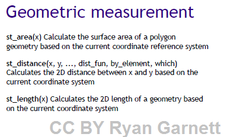
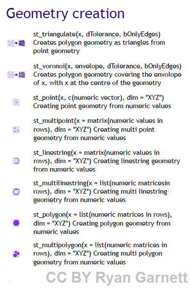
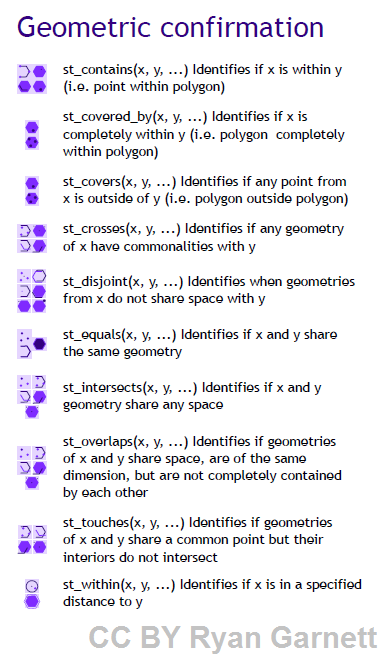
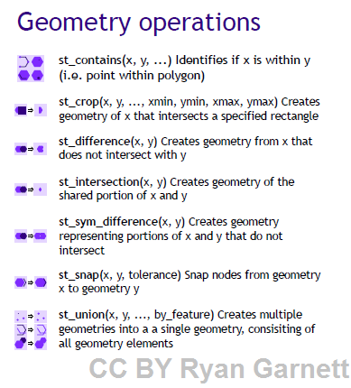

```{r, echo=FALSE, message=FALSE, warning=FALSE}
library(tidyverse)
knitr::opts_chunk$set(echo = TRUE, message=FALSE, warning=FALSE, comment=NA)
options(width=50)
```

# Package sf

<table><tr><td>

</img> 
Un package R qui fournit des méthodes standardisées pour encoder de la **donnée spatiale vectorielle**.


sf s'inscrit dans la logique du tidyverse, c'est-à-dire qu'il est compatible (entre autres) avec les principes de `dplyr` et `ggplot2` pour ce qui est, respectivement, de la manipulation des tableaux d'attributs et de la production des cartes.

</td><td>


sf pour "simple features".

**Feature** un objet dans le monde réel. Les "features" ont 

- une **géométrie**
- des **attributs**


```{r}
library(sf)
```

L'ensemble des fonctions du package sont facilement reconnaissables puisqu'elles commencent toutes par `st_...()` (st pour **s**patial et **t**emporal).
</td></tr></table>

# Géométries

<table><tr><td>
Les géométries peuvent être de type

- **point**
- **linestring**
- **polygon**

pour des objets individuels

</td><td>
Plus fréquemment, on a affaire à des géométries de type

- **multipoint**
- **multilinestring**
- **multipolygon**

Remarque:Simple feature geometry: **sfg**

</td></tr></table>


# Lecture/écriture de données spatiales vectorielles

<table><tr><td>

La **lecture** se fait tout simplement à l'aide de la fonction`st_read()`


```{r}
filename=system.file("shape/nc.shp", package="sf") # ex. de fichier shape téléchargé avec package sf
filename
nc <- st_read(filename)
```

plus d'infos sur la nature des attributs [ici](https://rdrr.io/rforge/spdep/man/nc.sids.html)


</td><td>
A la lecture, quelques **descripteurs de base** de l'objet sf sont affichés:

- le **chemin**
- le **driver** utilisé pour lire le fichier (ici ESRI shapefile)
- le **nombre de features** (ici 100) et le **nombre d'attributs** (ici 14)
- les **dimensions spatiales** de l'objet (ici XY)
- l'**emprise** (ou **b**ounding **box**) de la couche
- le code **EPSG** du système de coordonnées
- le code **proj4string** du système de projection
</td></tr></table>

# Lecture/écriture de données spatiales vectorielles

<table><tr><td>
L'**écriture** se fait à l'aide de la fonction `st_write()`

```{r, eval=FALSE}
st_write(nc,"datasets/nc/nc.shp")
```

L'ensemble des **fichiers auxiliaires** (avec le .shp: .shx, .dbf, .proj) est créé par cette commande.


Notez qu'il est possible d'avoir un aperçu de l'ensemble des couches de données spatiales vectorielles présentes dans un dossier:

```{r}
st_layers(system.file("shape",package="sf"))
```
</td></tr></table>


# Systèmes de coordonnées et transformations

<table><tr><td>

Connaître le système de coordonnées:

```{r}
st_crs(nc)
```

Indiquer le système de coordonnées:

```{r}
st_crs(nc) <- 4267
```


</td><td>

Transformer les coordonnées:

```{r}
nc.web_mercator <- st_transform(nc, 3857)
```
</td></tr></table>

# Exploration graphique

<table><tr><td>
Notez que la méthode `plot()` permet de prendre connaissance assez rapidement et facilement du contenu de l'objet sf:

</td><td>
```{r}
plot(nc, max.plot=4)
```
</td></tr></table>

# sf + dplyr

<table><tr><td>
Le package sf est compatible avec les fonctions de `dplyr` pour la manipulation de l'objet sf **à partir de la table d'attributs**. Cela signifie que l'on est en mesure de 

- **filtrer** les simple features sur leurs attributs,
- **sélectionner** certains attributs
- **modifier**/ajouter des attributs , ou encore 
- réaliser des **jointures**.

</td><td>
```{r, fig.height=2}
filter(nc, AREA >0.2) %>%
  plot()
```

```{r, fig.height=2}
select(nc,AREA) %>%
  plot()
```

```{r, fig.height=2}
mutate(nc, frac74 = SID74 / BIR74) %>% 
  select(frac74) %>%
  plot()
```
</td></tr></table>

# sf + ggplot

<table><tr><td>
Les objets de type `sf` sont par ailleurs compatibles avec la logique de `ggplot2`. Il est notamment possible de les tracer à l'aide du geom `geom_sf()`.

</td><td>
```{r}
library(ggplot2)
ggplot() +
  geom_sf(data = nc, aes(fill = BIR74)) +
  geom_sf(data= st_centroid(nc), color="yellow", aes(label="NAME"))+
  scale_y_continuous(breaks = 34:36)
```
</td></tr></table>


# Géométries: : mesures

L'ensemble des manipulations sur les géométries permises par le package sf sont explicitées dans cette [cheatsheet](https://github.com/rstudio/cheatsheets/raw/master/sf.pdf)

<table><tr><td>
Il est ainsi possible de réaliser des **mesures** telles que

- l'**aire** (pour une géométrie polygon/multipolygon)
- la **longueur** (pour une géométrie linestring/multilinestring)
- la **distance**

```{r}
nc %>% 
  mutate(aire=st_area(nc)) %>% 
  select(NAME,aire)
```

</td><td>
</img>
</td></tr></table>

# Opérations géométriques: construction

<table><tr><td>
Il est possible de créer un objet sf en construisant **sa géométrie** (création de points, création de lignes à partir de points, de polygones à partir de points, etc.)

```{r,fig.width=5,fig.height=2}
M=matrix(c(1,0,2,1,2,2),nrow=3)
M
pts=st_multipoint(M, dim="XY")
ggplot(pts)+geom_sf()
```

</td><td>
</img>
</td></tr></table>


# Opérations géométriques: relations

<table><tr><td>
Il est également possible de vérifier les **relations géométriques** entre objets sf (est-ce que tel objet croise tel autre, est-ce que ces polygones se touchent, se recouvrent, sont disjoints, etc.)

```{r,echo=FALSE, fig.width=5,fig.height=2}
pts=tibble(
  nom=c("pt1","pt2","pt3"),
  geometry=st_sfc(st_point(c(.5,.5)), st_point(c(1.5, 1.5)), st_point(c(2.5, 2.5)))) %>% 
  st_as_sf()

pol = tibble(nom=c("pol1","pol2"),
             geometry=st_sfc(st_polygon(list(rbind(c(0,0), c(2,0), c(2,2), c(0,2), c(0,0)))),
                             st_polygon(list(rbind(c(1,1.15), c(2.25,1.15), c(2.25,2.5), c(1,2.5), c(1,1.15))))
                             )) %>% 
  st_as_sf()

ggplot(pts)+
  geom_sf(col="dark grey",size=10)+
  geom_sf_text(aes(label=nom))+
  geom_sf(data=pol, alpha=0.1, fill=c("blue","red"), alpha=0.3)+
  geom_sf_text(data=st_centroid(pol),aes(label=nom),color=c("blue","red"))
```

Exemple: est-ce que les polygones contiennent les points?

```{r}
st_contains(pol,pts)
st_contains(pol,pts,sparse=FALSE)
```

</td><td>
</img>
</td></tr></table>


# Géométries: opérations

<table><tr><td>
Il est possible de réaliser des **opérations** sur les géométries (différences, intersections, union, etc.)

```{r, fig.height=2, fig.width=5}
pol
pol_reunited=st_union(pol)
ggplot(pol_reunited)+geom_sf()
```

</td><td>
</img>
</td></tr></table>


# On récapitule!

<table><tr><td style="width: 30%">

</td><td style="width: 70%">

- Principe de "sf" (attributs + **geometry**)
- Différents **types de simple features**
  + POINT/MULTIPOINT,
  + LINESTRING/MULTILINESTRING,
  + POLYGON/MULTIPOLYGON,
  + etc.
- Compatibilité avec **tidyverse** (dplyr,ggplot2)
- **Opérations sur les géométries**
  + mesures
  + construction
  + évaluation
  + opérations
</td></tr></table>


