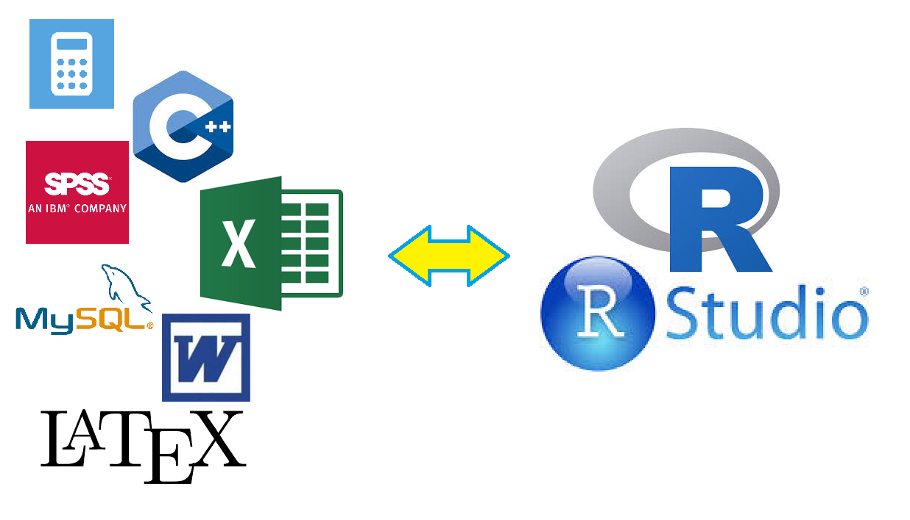

# Pourquoi utiliser le logiciel R?

<div id="left">
Le langage R est un **langage de programmation** et un **environnement mathématique** utilisé pour le **traitement de données** et l'**analyse statistique**.

Il est en outre d'utilisation **libre** et **gratuite** et peut être téléchargé par exemple à l'adresse suivante: http://cran.r-project.org/

L'installation prend au plus quelques minutes.

</div>

<div id="right">
Il permet de réaliser

- des **calculs arithmétiques** 
- des **tris et croisements** de données 
- une très large variété de **graphiques** 
- des **programmes** (automatisation de traitements)
- de la **modélisation et simulations numériques**
- une très large variété de **traitements statistiques** (c'est ce pour quoi il est le plus reconnu)
- des **rapports**, **pages web** et **diaporamas**
</div>


# Pourquoi utiliser le logiciel R?

<div id="left">
Il peut donc remplir les fonctions 

- d'une **calculatrice**, 
- d'un **tableur**, 
- d'un **langage de programmation**, 
- d'un **logiciel de statistiques**,
- d'un **logiciel de dessin** 
- d'un **éditeur de rapports et de présentations**...

Il est en outre **libre** et **gratuit**.
</div>


<div id="right">

</div>


En contrepartie de sa polyvalence et de sa flexibilité, R peut être un peu déroutant au premier abord, car il ne s'agit pas d'un logiciel "clic-boutons": on exécute les différentes opérations à travers l'exécution de **lignes de commande**.

# Console, commandes

<div id="left">
Au lancement de R, une fenêtre (la **console**) apparaît: le symbole ">" indique que R est prêt à exécuter toute ligne de commande que nous allons lui fournir.


</div>

<div id="right">
Un exemple de **ligne de commande**:

```{r}
2+2
```

Taper entrée pour exécuter la commande. R exécute la commande et nous affiche le résultat.
</div>

# Commentaires, historique des commandes

<div id="left">

## Commentaires

```{r}
32.7*59.6 # multiplication
```

Les indications précédées du symbole **$\#$** sont des **commentaires**. Ils sont ignorés par R mais vous seront très utiles pour **annoter vos scripts**.

</div>


<div id="right">

## Historique

Si l'on exécute plusieurs lignes de commandes dans la console, on peut "récupérer" les **lignes de commandes précédemment exécutées** avec la flèche **$\uparrow$** ou au contraire en récupérer de plus récentes avec **$\downarrow$**.
</div>

# Assignation

<div id="left">
Lorsque vous exécutez une commande, vous pouvez en observer le résultat directement dans la console:

```{r}
32.7*59.6 
53/59 
```

Vous pouvez également choisir d'attribuer ce résultat à un **objet**.

```{r}
a <- 32.7*59.6 
b <- 53/59 
```

On dit qu'on **assigne une valeur à un nom (ou à une variable)**. On a ainsi créé les objets a et b.

</div>

<div id="right">

Remarquez que vous pouvez de manière tout-à-fait équivalente utiliser les commandes suivantes ("=" est également un opérateur d'assignation):

```{r}
a = 32.7*59.6 
a <- 32.7*59.6 
```


En revanche, R est **sensible à la casse** donc les deux commandes suivantes créerons deux objets distincts!

```{r}
a <- 32.7*59.6 
A <- 32.7*59.6 
```

</div>

# Environnement

<div id="left">

```{r}
a <- 32.7*59.6 
b <- 53/59 
```

Lorsque vous exécutez les commandes ci-dessus, **rien ne s'affiche dans la console**. Cela ne signifie pas pour autant que rien ne s'est passé... Vous avez **créé les objets a et b**, qui font désormais partie de votre environnement de travail... 

</div>

<div id="right">

Rappelez-vous, ces objets apparaissent dans la zone **Environnement** de RStudio. Vous pouvez également afficher la liste des objets dans l'environnement global de la manière suivante:

```{r}
ls()
```
</div>

# Affichage des objets

<div id="left">
Pour afficher la valeur des objets dans la console, plusieurs possibilités:

```{r}
a
print(a)
```

</div>

<div id="right">
Vous pourrez par la suite manipuler les objets de différentes façon... Par exemple, ici on peut les utiliser pour de simples opérations arithmétiques:


```{r}
a+b  # calcul puis affichage
c <- a+b # calcul et creation d'objet
print(c) # affichage
```
</div>


# RStudio: scripts et IDE

<div id="left">
## Historique vs Script

Comment **garder une trace pérenne** des différentes commandes et de leur succession?

L'ensemble des lignes de commande exécutées dans la console (y compris tâtonnements) = l' **historique** (.Rdata)

L'ensemble des lignes de commandes nécessaires à exécuter une tâche = un **script** (.R)

(i.e. un fichier texte contenant l'ensemble des lignes de commande mises au propre et commentées!)

</div>

<div id="right">

## l'IDE RStudio

Nous allons travailler sur un éditeur de script (ou plus précisément un **IDE**, pour Integrated Development Environment) le logiciel **RStudio**. 

Il est lui aussi **libre et gratuit** et peut être téléchargé à l'adresse suivante:
http://www.rstudio.com/ide/. 

</div>

# RStudio: Fonctionnalités

<div id="left">
Dans RStudio, quatre zones apparaissent:

- **Source** en haut à gauche,
- **Console** en bas à gauche, 
- **Environnement** en haut à droite
- **Plots** en bas à droite
</div>

<div id="right">

</div>

# RStudio: zone Console

<div id="left">
La zone Console de RStudio correspond en fait à l'**interpréteur R de base**... C'est cette console qui s'ouvre quand vous lancez R (sans RStudio)... Simplement ici, la console est "enrobée" de différents outils pour vous aider à travailler...
</div>

<div id="right"> 

</div>

# RStudio: zone Source

<div id="left">
La zone **Source** constitue l'éditeur de code à proprement parler. C'est dans cette zone que vous allez écrire vos scripts. 

Les calculs sont exécutés dans la zone **Console**. On peut envoyer les codes de la zone "Source" vers la zone "Console"

- grâce au bouton **Run** (qui exécute la ou les lignes de commande sélectionnée(s)) 
- grâce au bouton **Source** (qui exécute l'ensemble des lignes de commande du script). 
</div>

<div id="right"> 

</div>

# RStudio: zone Environment/History

<div id="left">
- onglet **Environment**: il vous permet de consulter l'ensemble des objets de votre environnement
- onglet **History**: il vous permet de consulter l'historique de vos commandes (i.e. l'ensemble des commandes que vous avez exécutées depuis le lancement de votre session).
</div>

<div id="right"> 

</div>

# RStudio: zone Files/Plots/Packages/Help

<div id="left">
- onglet **Files**: il vous permet de naviguer dans vos dossiers et d'ouvrirs/renommer/supprimer vos fichiers.
- onglet **Plots**: c'est là que s'afficheront (par défaut) les graphiques produits. Il vous permet donc de vérifier d'un coup d'oeil vos sorties graphiques... 
- onglet **Packages**: vous montre l'ensemble des packages installés et chargés pour la session actuelle.
- onglet **Help**: vous pouvez y consulter les fichiers d'aide associés aux différentes fonctions de R.
</div>


<div id="right"> 

</div> 
    
