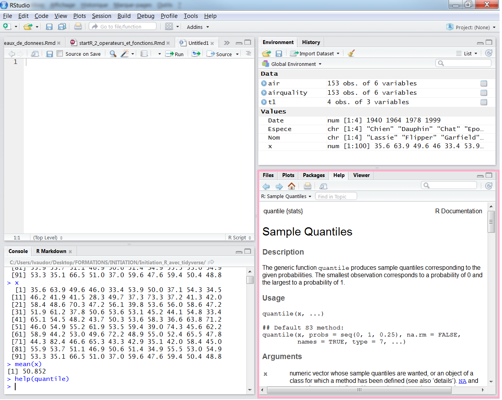
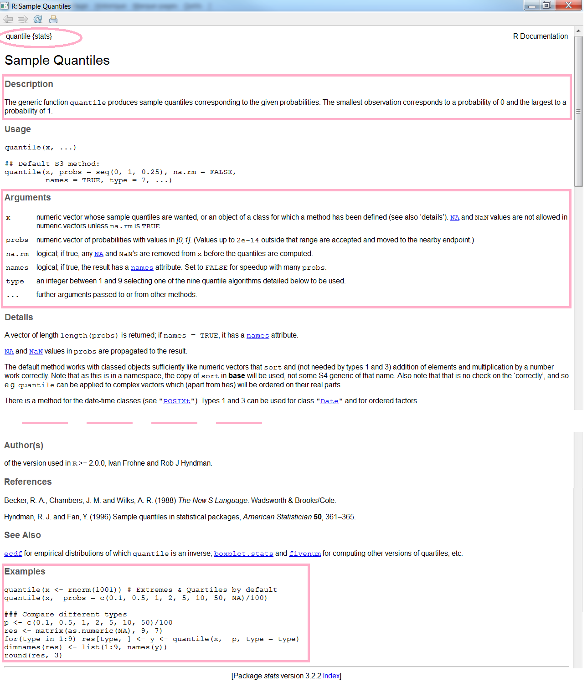
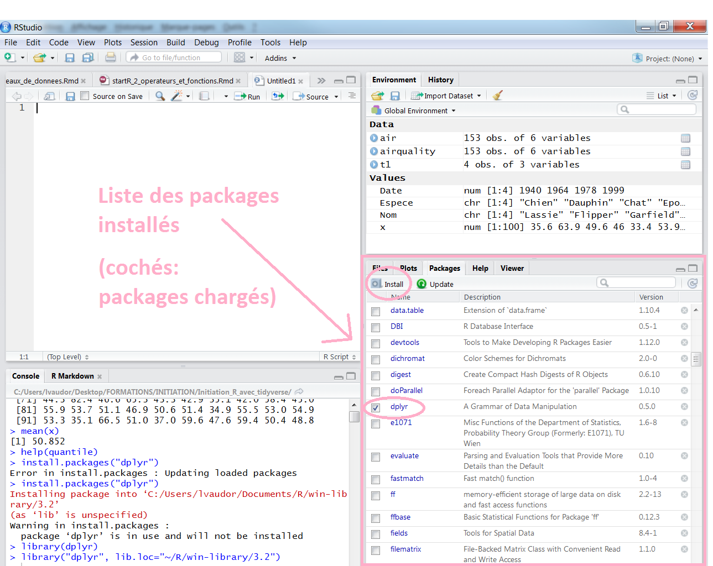

```{r, echo=FALSE}
v1 <- c(2.3,3.6,1.1,2.4,2.5,10.2,5.1,2.0)
v2 <- c("Paris","Lyon","Marseille","Rennes","Montpellier")
```

# Opérateurs arithmétiques

Ils permettent d'effectuer des opérations arithmétiques simples, comme des additions, des multiplications,etc.

<div id="left">

```{r}
v1
```

```{r}
v1+4 # addition
v1-3 # soustraction
v1*5 # multiplication
v1/4 # division
v1^2 # puissance
```
</div>

# Opérateurs de comparaison

Ils permettent de **comparer** des vecteurs entre eux.

<div id="left">

```{r}
v1
```

```{r}
v1==3.6 # égal à
v1!=2   # différent de
```

</div>
<div id="right">

```{r}
v1
```

```{r}
v1<4  # plus petit
v1>10 # plus grand
v1<=5 # plus petit ou égal
v1>=3 # plus grand ou égal
```
</div>

# Opérateurs logiques

Ils permettent de **vérifier si une proposition est vraie** ou non.

```{r}
v1
```

```{r}
!(v1>10)    # NON logique
v1<2 & v1>5 # ET logique
v1<3 | v1>5 # OU logique
```

Notez également l'existence de la fonction **is.na()** qui permet d'évaluer si les éléments d'un vecteur sont vides ou non!

```{r}
v9 <- c(3.2, NA, 8.9, 42.3, 59.2, NA)
is.na(v9)
```


# Opérateurs logiques ou de comparaison et fonction which()

L'utilisation d'opérateurs de comparaison et d'opérateurs logiques permet notamment de **rechercher certains éléments des objets ayant certaines caractéristiques**, grâce à la fonction `which()`.

Par exemple:

<div id="left">
```{r}
v1
which(v1>3)
v1[which(v1>3)]
```

</div>
<div id="right">

```{r}
v2
which(v2=="Marseille")
v2[which(v2=="Marseille")]
```
</div>

Notez bien la différence entre les **indices** et les **valeurs** des vecteurs: `which` renvoie des **indices**, c'est à dire des numéros d'éléments.

# Description des variables: Moyenne et médiane

<div id="left">

On peut décrire le **mode** d'une variable via sa **moyenne** ou sa **médiane**.

```{r, echo=FALSE}
x=round(rnorm(50,50,10),1)
```

```{r}
x
```

```{r, echo=FALSE, height=2, width=8}
hist(x,col="grey", breaks=20)
abline(v=mean(x),col="deepskyblue", lwd=3)
abline(v=median(x), col="hotpink", lwd=3)
```
</div>

<div id="right">


La **moyenne** d'une variable $x=(x_1,x_2,...,x_n)$ est égale à

$$
\bar{x}=\frac{1}{n}\sum_{i=1}^{n}{x_i}
$$

```{r}
mean(x)
```

La **médiane** d'une variable $x=(x_1,x_2,...,x_n)$ est égale à la valeur $x_i$ telle qu'il y ait la moitié des observations au-dessus de $x_i$, et la moitié en dessous.

```{r}
median(x)
```

La **distinction entre moyenne et médiane** peut être importante quand la variable a une distribution **asymétrique**.
</div>

# Description des variables: Variance et écart-type

<div id="left">
On peut décrire la **variabilité** des données à travers la **variance** ou l'**écart-type**:

La variance et l'écart type de $x=(x_1,x_2,...,x_n)$ sont égales à
$$
var(x)=\frac{1}{n-1}\sum_{i=1}^{n}{(x_i-\bar{x})^2}
$$
$$
sd(x)=\sqrt{var(x)}
$$


$\sum{(x_i-\bar{x})^2}$ est la somme des écarts au carré entre les observations et la moyenne. Autrement dit, la variance est, à peu de choses près,la **moyenne des [[écarts à la moyenne] au carré]**. 


</div>
<div id="right">
Dans R, on calcule variance et écart-type à l'aide des fonctions `var()` et `sd()` 

```{r}
var(x)
sd(x)
```

```{r, echo=FALSE, height=2, width=8}
hist(x,col="grey", breaks=20)
points(c(mean(x),mean(x)+sd(x)),
       c(3,3),type="l",lwd=3,
       col="deepskyblue")
```

</div>

# Description des variables: Quantiles, minimum, maximum

<div id="left">
Le **quantile d'ordre p** de $x=(x_1,x_2,...,x_n)$ correspond à la valeur $\lambda$ telle que p\% des données sont inférieures à p.

\begin{eqnarray}
pr(X \leq \lambda)=p
\end{eqnarray}

Les quantiles d'ordre 25\%, 50\%, et 75\% sont aussi appelés **premier quartile**, **deuxième quartile** (ou **médiane**), et **troisième** quartile.

```{r}
quantile(x, 0.10)
```

Le quantile d'ordre 10\% (ou 0.10) de x est `r quantile(x, 0.10)`. 

Cela signifie que seulement 10\% des valeurs de x sont inférieures à `r quantile(x, 0.10)`. 
</div>


<div id="right">


Par ailleurs, le **minimum** et **maximum** des variables peuvent être affichés comme suit:

```{r}
min(x)
max(x)
```

```{r, echo=FALSE, height=2, width=8}
hist(x,col="grey", breaks=20)
abline(v=quantile(x,0.1),col="deepskyblue", lwd=3)
abline(v=range(x), col="hotpink", lwd=3)
```
</div>

# Fonctions : Quelques remarques

<div id="left">
Nous avons d'ores et déjà utilisé un certain nombre de fonctions, comme 

- **c()**, 
- **seq()**, 
- **rep()**, 
- **matrix()**, 
- **mean()**, etc.

Toutes les fonctions que nous avons utilisées jusqu'à présent sont définies sur le **package de base** de R. 

Les fonctions sont des **objets** qui ont toutes un **point commun**: elles s'écrivent avec des **parenthèses**, dans lesquelles l'utilisateur précise la **valeur des arguments** si besoin est.

</div>
<div id="right">
Les arguments peuvent être **obligatoires** (la fonction ne peut pas fonctionner si ces arguments ne sont pas fournis par l'utilisateur) ou au contraire **optionnels**. Par exemple, dans 


```{r}
quantile(x=x, probs=0.1)
```

l'argument `x` est obligatoire, et l'argument `probs` est optionnel. On peut ainsi ne passer que l'argument `x` à la fonction:

```{r}
quantile(x=x)
```
               
</div>

# Fonctions: Quelques remarques

<div id="left">
Si l'on passe les arguments à la fonction **dans le bon ordre**, on n'a pas besoin de préciser le nom des arguments. Ainsi, il est possible d'appeler la fonction `quantile` des deux manières suivantes:

```{r}
quantile(x=x, probs=0.1)
quantile(x,0.1)
```

En revanche, l'appel suivant produira une erreur:

```{r, error=TRUE}
quantile(0.1,x)
```
</div>

<div id="right">
Pour accéder aux **informations** quant aux **arguments** d'une fonction, on peut consulter l'aide associée des deux façons suivantes:

```{r, eval=FALSE}
help(quantile)
?quantile
```



</div>

# Fonctions: Aide

<div id="left">
Le fichier d'aide associé à une fonction est toujours structuré de la même manière. Sans trop détailler, voici les parties qui me semblent les plus importantes...

- **Description** qui décrit succintement le but de la fonction
- **Arguments** qui détaille les arguments, vous montre l'ordre dans lequel ils sont attendus, et vous précise leur effet ainsi que leurs valeurs par défaut (le cas échéant).
- une partie **Exemples** qui permet généralement de tester la fonction pour comprendre rapidement son usage.

**Détails** et **References** permettent en outre d'expliquer les détails de la méthode et éventuellement de citer la ou les publications associées à la méthode/fonction ou package.

</div>

<div id="right">

</div>


# Packages

Les packages sont des **paquets de fonctions** visant à réaliser des tâches un peu particulières. L'installation de base de R vous installe, par défaut, un certain nombre de packages (`base`, `methods`, `stats`, `graphics`, etc.)

Dans la suite de ce cours, nous serons amenés à utiliser le package **dplyr** qui sert à manipuler des tableaux de données.

<div id="left">

Pour être en mesure d'utiliser les fonctions de ce package, il faut:

- **Installer le package**: les fonctions du package sont alors téléchargées depuis un serveur distant et enregistrées sur le disque dur de votre ordinateur:


```{r, eval=FALSE}
install.packages("dplyr")
```

- **Charger le package** (les fonctions du package sont chargées dans l'environnement R pour la session en cours)

```{r, eval=FALSE}
library(dplyr)  
```
</div>
<div id="right">
Vous pouvez également installer et charger les packages en passant par RStudio:


</div>
