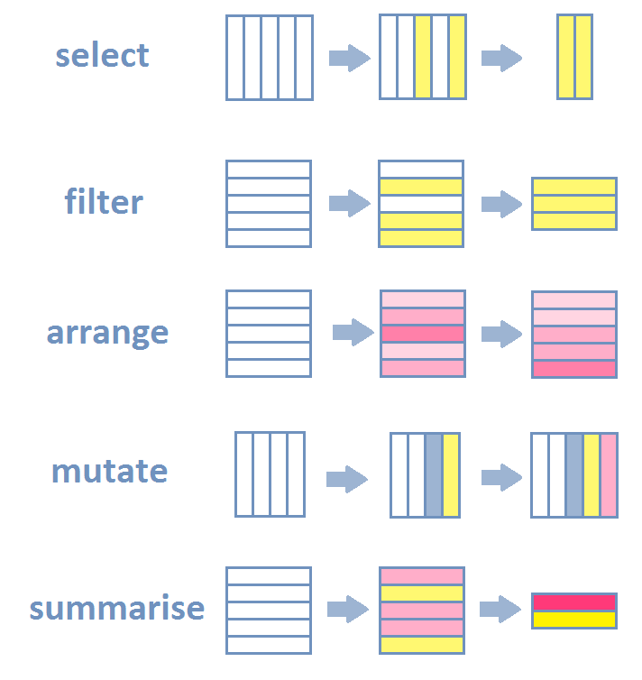

# Lecture de tables: Répertoire de travail

Le **répertoire de travail** (**w**orking **d**irectory) est le **dossier de votre ordinateur où, sauf précision de votre part, R lit et écrit les fichiers**.

<div id="left">
Vous pouvez afficher le répertoire de travail  de la manière suivante:

```{r}
getwd()
```

```{r, echo=FALSE}
wd=getwd()
```

Vous pouvez changer de répertoire de travail avec la commande `setwd()`:

```{r}
setwd("../../GRAPHIQUES_GGPLOT2/")
getwd()
```

```{r, echo=FALSE}
setwd(wd)
```
Remarquez que le chemin est écrit **avec des `/` et non avec des `\`**
</div>

<div id="right">
Vous pouvez également utiliser les **fonctionnalités de RStudio** pour changer de répertoire de travail.


</div>

# Lecture de tables: Fonction read.table()

<div id="left">
Examinons la commande suivante:

```{r, echo=TRUE}
air <- read.table(file="datasets/air.txt",
                  sep=",",
                  dec=".",
                  header=T)
air[1:3,]  # 3 premieres lignes du tableau
```

La fonction read.table() permet de **lire** la table contenue dans le **fichier "air.txt"** qui se trouve dans le dossier "datasets" du répertoire de travail.

</div>

<div id="right">

Le chemin vers le fichier est ici indiqué de manière **relative** c'est-à-dire qu'on indique comment trouver "air.txt" depuis le répertoire de travail actuel. 

Le chemin peut aussi être indiquée de manière **absolue**, en indiquant le chemin complet depuis la racine:
```{r}
air <- read.table(file="C:/Users/lvaudor/Desktop/FORMATIONS/INITIATION/startR/datasets/air.txt",
                  sep=",",
                  dec=".",
                  header=T)
```

</div>

# Lecture de tables: Fonction read.table()

<div id="left">
Examinons la commande suivante:

```{r, echo=TRUE}
air <- read.table(file="datasets/air.txt",
                  sep=",",
                  dec=".",
                  header=T)
air[1:3,]  # 3 premieres lignes du tableau
```

Il existe de **nombreux arguments** à cette fonction, qui sont détaillés dans le fichier d'aide associé.

</div>


<div id="right">

Outre l'argument **file** qui permet d'indiquer le chemin du fichier à lire, voici quelques uns des arguments les plus importants:

- le **séparateur de colonnes** : par ex. une virgule (`sep=","`), un point-virgule (`sep=";"`), une tabulation? (`sep="\tab"`), etc.
- le **séparateur décimal** (`dec=","` ou `sep="."` ) 
- la présence d'un **header** i.e. le fait que la première ligne du tableau corresponde aux noms des variables (`header=TRUE`) ou non (`header=FALSE`)

</div>

# Lecture de tables: Nettoyer ses données!

Attention, utilisateurs de tableurs, cette diapo est pour vous... 

Si vous avez des difficultés à lire votre tableau des données, c'est sans doute parce que celui-ci n'est pas un tableau de données **brutes**.

<div id="left">
Pour lire un tableau de données sous R, il convient d'abord de **nettoyer ce tableau**:

- Vérifier que les noms de colonnes ne contiennent pas de **caractères spéciaux ou des espaces**, avoir des noms de variables **courts** mais **explicites**
- Vérifier si certains champs correspondent en fait à des **commentaires**, si votre tableur contient des **graphiques**, etc.. 

</div>
<div id="right">

</div>
# Lecture de tables: en passant par RStudio

On peut également utiliser les **fonctionnalités de RStudio** pour afficher et modifier la table.

<div id="left">

</div>
<div id="right">

</div>

# Lecture de tables: attacher/détacher

Pour accéder à une des variables d'un tableau il faut a priori utiliser le système d'indexation (`table$variable`).

On peut également **attacher** le tableau de données à l'environnement R pour ne pas avoir à taper le nom du tableau sans arrêt:

```{r, echo=TRUE}
attach(air)
Ozone[1:40]
```

A l'inverse, on peut redétacher une table de la manière suivante:
```{r, error=TRUE}
detach(air)
Ozone[1:40]
```

# Ecriture de tables: Fonction write.table()

```{r, echo=FALSE}
Espece <- c("Chien","Dauphin","Chat","Eponge")
Nom <- c("Lassie","Flipper","Garfield","Bob")
Date <- c(1940,1964,1978,1999)
t1 <- data.frame(Espece,Nom,Date)
```

<div id="left">
A l'inverse, il est possible d'écrire des fichiers depuis R. Pour écrire une table, par exemple:

```{r}
t1
write.table(t1,
            "datasets/table_animaux_stars.csv",
            sep=";",
            col.names=TRUE,
            row.names=FALSE)
```
</div>
<div id="right">
Cette-fois les arguments principaux sont:

- **x**: l'objet table à écrire
- **file**: le nom de fichier de votre choix (ou chemin, si vous ne souhaitez pas écrire le fichier dans le répertoire de travail)
- **sep**: le séparateur de colonnes
- **col.names**: pour écrire les noms de colonnes (par défaut: TRUE)
- **row.names**: pour écrire les noms de lignes (par défaut: TRUE).
</div>

# Structure et dimensions d'une table

<div id="left">

```{r}
str(air) # structure du tableau
colnames(air) # nom des colonnes
``` 

```{r}
dim(air) # dimensions
length(air$Ozone) # longueur du vecteur
nrow(air) # nombre de lignes
ncol(air) #nombre de colonnes

```
</div>

<div id="right">

Pour afficher les **premières lignes** du tableau:
```{r}
head(air)
```

Pour afficher les **dernières lignes** du tableau:
```{r}
tail(air)
```
</div>

# RStudio view data


```{r}
require(dplyr)
```


# dplyr: Introduction()

<div id="left">

**dplyr** est un package qui permet de faire simplement diverses opérations sur les tableaux de données:

- `select()` permet de **sélectionner des variables** (colonnes)
- `filter()` permet de **filtrer les individus** (lignes)
- `arrange()` permet de **réarranger le tableau selon l'ordre des variables**
- `mutate()` permet de **créer et ajouter de nouvelles variables** (colonnes)
- `summarise()` permet de **résumer plusieurs valeurs en une seule** 

</div>
<div id="right">

</div>


# dplyr: select()

<div id="left">


**select()** permet de **sélectionner des variables**

Par exemple, on peut sélectionner des variables de la table `air`

```{r}
head(air)
```

</div>

<div id="right">

- en spécifiant les **noms** ou **numéros** des variables à **conserver**
```{r}
data <- select(air,Ozone,Wind,Temp)
data[1:2,]
data <- select(air, 1,3,4)
data[1:2,]
```

- en spécifiant le **nom** ou les **numéros** des variables à **écarter** avec le signe **-**

```{r}
data <- select(air,-Month,-Day)
data[1:2,]
```
</div>


# dplyr: select()


<div id="left">


**select()** permet de **sélectionner des variables**
en passant par des **fonctions auxiliaires**. On peut citer par exemple:

- `starts_with` pour les variables qui **commencent** par un texte donné
- `ends_with` pour les variables qui **terminent** par un texte donné
- `contains` pour les variables qui **contiennent** un texte donné
- etc.
</div>
<div id="right">

```{r, echo=FALSE}
dat_tmp=data.frame(
  X=rnorm(30,3,2),
  Y=rnorm(30,5,1),
  conc_Fe=rlnorm(30,1,0.1),
  conc_Mg=rlnorm(30,2,0.1),
  conc_Pb=rlnorm(30,1.2,0.1)
)
```
Par exemple:

```{r}
head(dat_tmp)
data <- select(dat_tmp,starts_with("conc"))
head(data)
```
</div>

# dplyr: filter()

<div id="left">


**filter()** permet de **filtrer les lignes du tableau** en fonction des valeurs de telle ou telle variable.

Ici, par exemple, on cherche toutes les lignes qui correspondent au mois de juillet:

```{r}
data <- filter(air,Month==7)
nrow(data)
head(data)
```
</div>

<div id="right">

On peut **combiner plusieurs conditions logiques** (ET logique, par une virgule ou un &, OU logique, par l'opérateur |).

Par exemple,

- pour ne conserver que les lignes qui telles que Ozone>100 **et** Wind>5:

```{r}
data <- filter(air, Ozone>100, Wind>5)
data
```

- pour ne conserver que les lignes telles que Month==7 **ou** Month==8:

```{r}
data <- filter(air, Month==7|Month==8)
nrow(data)
```
</div>

# dplyr: arrange()

<div id="left">


Pour réarranger un tableau selon l'ordre d'une variable, on peut faire appel à la fonction `arrange` (ici, par exemple on réordonne `air` selon l'ordre croissant de `Temp` et `Wind`):

```{r}
data <- arrange(air,Temp, Wind)
head(data)
```
</div>
<div id="right">
et pour ordonner par ordre décroissant, on utilise* **desc()**:

```{r}
data <- arrange(air,desc(Temp))
head(data)
```
</div>

# dplyr: mutate()

<div id="left">


Pour créer de nouvelles variables et les ajouter au tableau de données on peut utiliser la fonction **mutate()**.


Voici par exemple comment procéder si je souhaite créer une nouvelle variable, "Date", en combinant les variables `Month` et `Day`:

```{r}
data <- mutate(air,Date=paste(Month,"-",Day,sep=""))
head(data)
```

</div>

<div id="right">

- pour transformer les °F en °C:

```{r}
air=mutate(air,Temp=(Temp-32)/1.8)
head(air)
```

ou si je souhaite calculer des classes de vitesses de vent

```{r}
data=mutate(air,
            gWind=cut(Wind,breaks=quantile(Wind)))
head(data)
```
</div>

# dplyr: summarise()


<div id="left">


Si l'on souhaite calculer quelques **statistiques** un peu basiques sur un jeu de données, on peut utiliser la fonction **summarise()**.


Par exemple:

```{r}
data <- summarise(air,
                  mean_Temp=mean(Temp),
                  nb_Mois=n_distinct(Month),
                  nb_Mesures=n())
data
```

</div>

<div id="right">

Et surtout, si je souhaite calculer une statistique pour **différents groupes** (définis ici, par exemple, par la variable `Month`), je vais le spécifier dans l'argument spécifiant la table de données, à l'aide de **group_by()**:

```{r}
data <- summarise(group_by(air,Month),
                  mean_Temp=mean(Temp),
                  nb_Mesures=n())
data
```

</div>
  

# dplyr: Chaînage

Vous avez vu que les fonctions de `dplyr` permettaient de faire toutes sortes d'opérations sur les tableaux de données. Il est bien entendu possible de les **combiner** pour réaliser des opérations complexes...

<div id="left">
Imaginons par exemple que l'on souhaite répondre à une question telle que 

"Quelle est la moyenne de concentration en Ozone pour les 10% de jours les plus chauds de l'année?"

Pour répondre à cette question, je pourrais par exemple (il y a en fait plusieurs possibilités):

- **sélectionner** les variables qui m'intéressent, à savoir `Ozone` et `Temp`

- **filtrer** pour ne garder que les lignes avec une température supérieure ou égale au quantile d'ordre 90% de Temp

- **résumer** l'information pour obtenir la moyenne de température

</div>
<div id="right">
Classiquement, pour coder cette chaîne d'opérations sous R, on procéderait de la manière suivante:

```{r}
q <- quantile(air$Temp, 0.9)
data1 <- select(air, Ozone, Temp)
data2 <- filter(data1, Temp>=q)
data3 <- summarise(data2, mean_Ozone=mean(Ozone, na.rm=TRUE))
data3
```
</div>

# dplyr: Chaînage

<div id="left">
Si je souhaitais réaliser cet enchaînement de commandes en une seule opération, et ainsi éviter la création d'objets intermédiaires data1, data2, etc., voici (classiquement) comment il faudrait procéder:

```{r}
q <- quantile(air$Temp, 0.9)
data <- summarise(filter(select(air,
                                Ozone,
                                Temp),
                         Temp>=q),
                   mean_Ozone=mean(Ozone, na.rm=TRUE))
data
```
</div>
<div id="right">

`dplyr` permet d'inverser l'ordre de cette syntaxe en permettant d'utiliser un opérateur (l'opérateur "pipe") qui s'écrit de la manière suivante : **%>%** et que l'on pourrait (en gros) traduire par **"et puis"**...

Voyez plutôt comment le code ci-dessus peut être simplifié par l'usage de cet opérateur:

```{r}
q <- quantile(air$Temp, 0.9)
data <- air %>%
  select(Ozone,Temp) %>%
  filter(Temp>=q) %>%
  summarise(mean_Ozone=mean(Ozone,na.rm=TRUE))
data
```
</div>

