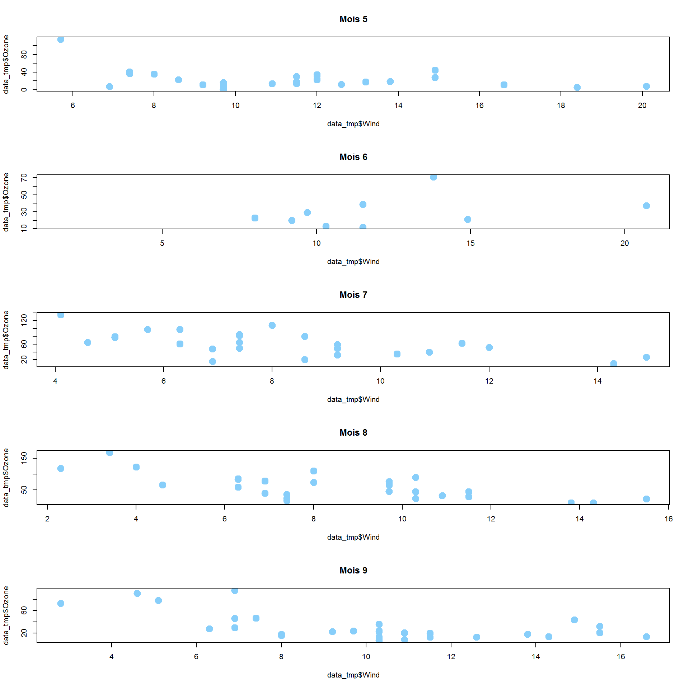

```{r, echo=FALSE}
air <- read.table(file="datasets/air.txt",
                  sep=",",
                  dec=".",
                  header=T)
```

# Structures conditionnelles

<div id="left">
Les instructions conditionnelles (**if** ou **if else**) permettent d'exécuter (ou non) certaines commandes en fonction de conditions spécifiées par l'utilisateur.

Voici la structure d'une instruction conditionnelle **if**:
```{r, eval=FALSE}
if(condition){
  ...
  ...
  ...
}
```

Et **if else**:

```{r, eval=FALSE}
if(condition){
  ...
}else{
  ...
}

```

</div>
Exemples:

<div id="right">
```{r}
Temperature <- 21
if(Temperature<15){
  print("il fait frisquet aujourd'hui!")
}
Temperature <- 12
if(Temperature<15){
  print("il fait frisquet aujourd'hui!")
}
```

```{r}
Temperature <- 21
if(Temperature<15){
  print("il fait frisquet aujourd'hui!")
}else{
  print("il fait bon aujourd'hui!")
}
```
</div>

# Boucles for

<div id="left">
Les boucles **for** permettent d'exécuter des instructions de manière itérative (ou répétée).

Voici la structure d'une instruction **instruction for**:
```{r, eval=FALSE}
for(compteur in sequence){
  ...
  ...
  ...
}
```
Par exemple:

```{r}
for(i in 1:5){
  print(paste("On en est à",i,"!"))
}
```
</div>

<div id="right">
Autre exemple:

```{r}
layout(matrix(1:6,nrow=2))
for(i in 1:6){
  plot(air[,i],
       col="hotpink",pch=20,
       main=colnames(air)[i])
}
```


</div>


# Fonctions: Ecrire ses propres fonctions

<div id="left">
L'utilisateur peut **créer lui-même ses fonctions**, par exemple s'il pense répéter plusieurs fois un même type de traitement.

Une fonction s'écrit de la manière suivante:

```{r, eval=FALSE}
mafonction <-function(argument1,argument2){
  ...
  ...
  resultat <- ...
  return(resultat)
}
```

</div>
<div id="right">

Par exemple, la fonction

```{r}
Tconversion  <-function(x){
    reponse=(x-32)/1.8
    return(reponse)
}
```

convertit les températures en degrés Fahrenheit, en températures en degrés Celsius. On peut par exemple la tester de cette manière: 

```{r}
Tconversion(451)
```

</div>

# Quelques exemples en plus de fonctions, structure if et for...

<div id="left">
```{r}
Tconversion <- function(x, type="FtoC"){
  if(type=="FtoC"){
    resultat <- (x-32)/1.8
  }
  if(type=="CtoF"){
    resultat <- 1.8*x+32
  }
  if(type!="FtoC" & type!="CtoF"){
    resultat <- "Pas compris!"
  }
  return(resultat)
}
```

</div>
<div id="right">

Testons cette fonction:

```{r}
Tconversion(451)
Tconversion(451, type="FtoC")
Tconversion(232, type="CtoF")
Tconversion(232, type="kekek!")
```
</div>


# Quelques exemples en plus de fonctions, structure if et for...

<div id="left">
```{r, warning=FALSE, message=FALSE,fig.show="hide", fig.path="figures/",label="exemplefor",fig.width=10,plot=FALSE, fig.height=10}
layout(matrix(1:5,nrow=5))
require(dplyr)
for (i in 5:9){
  data_tmp <- filter(air, Month==i)
  plot(data_tmp$Wind, data_tmp$Ozone,
       main=paste("Mois", i),
       col="lightskyblue",pch=20, cex=3)
}
```

</div>
<div id="right">

</div>

# Quelques exemples en plus de fonctions, structure if et for...
